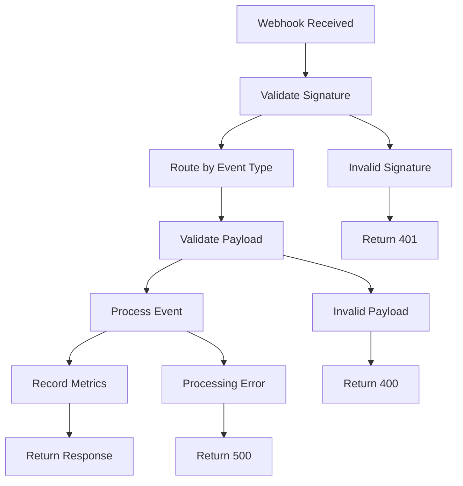

# FlakeGuard GitHub App API Documentation

This documentation provides a comprehensive guide to integrating with the FlakeGuard GitHub App API, including webhook handling, check run management, workflow operations, and security best practices.

## Table of Contents

- [Overview](#overview)
- [Authentication & Authorization](#authentication--authorization)
- [Webhook Integration](#webhook-integration)
- [Check Run Management](#check-run-management)
- [Workflow Operations](#workflow-operations)
- [Artifact Management](#artifact-management)
- [Error Handling](#error-handling)
- [Rate Limiting](#rate-limiting)
- [Security Best Practices](#security-best-practices)
- [SDK Examples](#sdk-examples)

## Overview

The FlakeGuard GitHub App API follows RESTful principles and provides:

- **Webhook Processing**: Secure handling of GitHub webhook events
- **Check Run Management**: Create, update, and manage GitHub check runs
- **Workflow Operations**: Rerun workflows and jobs, manage workflow state
- **Artifact Management**: List and download test artifacts and reports
- **Flake Detection**: Automated analysis of test flakiness patterns

### Base URL

```
https://api.flakeguard.dev/api/github
```

### API Version

Current API version: `v1`

All requests should include the version in the Accept header:

```http
Accept: application/vnd.flakeguard.v1+json
```

## Authentication & Authorization

### GitHub App Installation

FlakeGuard uses GitHub App authentication for secure access to repositories.

1. **Install the GitHub App** on your organization or repository
2. **Grant required permissions**:
   - Actions: `write` (workflow operations)
   - Checks: `write` (check run management)
   - Contents: `read` (repository access)
   - Issues: `write` (creating flake reports)
   - Pull requests: `write` (PR integration)

3. **Configure webhook endpoint**: `https://api.flakeguard.dev/api/github/webhook`

### API Authentication

API requests require a GitHub App installation token:

```http
Authorization: Bearer <installation_token>
```

Installation tokens are automatically managed by the GitHub App and expire after 1 hour.

## Webhook Integration

### Webhook Endpoint

**POST** `/webhook`

Receives and processes GitHub webhook events.

#### Required Headers

```http
Content-Type: application/json
X-GitHub-Event: <event_type>
X-GitHub-Delivery: <delivery_id>
X-Hub-Signature-256: sha256=<signature>
```

#### Supported Events

- `check_run` - Check run lifecycle events
- `check_suite` - Check suite completion
- `workflow_run` - Workflow execution events  
- `workflow_job` - Individual job events
- `pull_request` - PR lifecycle events
- `push` - Code push events
- `installation` - App installation events

#### Response Format

```json
{
  "success": true,
  "message": "Webhook processed successfully"
}
```

### Webhook Signature Validation

FlakeGuard validates webhook signatures using HMAC-SHA256:

```typescript
import crypto from 'crypto';

function validateSignature(payload: string, signature: string, secret: string): boolean {
  const hmac = crypto.createHmac('sha256', secret);
  hmac.update(payload, 'utf8');
  const digest = `sha256=${hmac.digest('hex')}`;
  return crypto.timingSafeEqual(Buffer.from(signature), Buffer.from(digest));
}
```

### Event Processing Flow



## Check Run Management

### Create Check Run

**POST** `/repos/{owner}/{repo}/check-runs`

Creates a new check run for a specific commit.

#### Request Body

```json
{
  "name": "FlakeGuard Test Analysis",
  "headSha": "abc123...",
  "status": "in_progress",
  "output": {
    "title": "Analyzing test results for flakiness",
    "summary": "Running analysis on 42 test cases..."
  },
  "actions": [
    {
      "label": "Quarantine Flaky Tests",
      "description": "Mark detected flaky tests for quarantine",
      "identifier": "quarantine"
    }
  ]
}
```

#### Response

```json
{
  "success": true,
  "data": {
    "id": 123456789,
    "name": "FlakeGuard Test Analysis",
    "headSha": "abc123...",
    "status": "in_progress",
    "conclusion": null,
    "startedAt": "2024-01-15T10:30:00Z",
    "completedAt": null,
    "output": {
      "title": "Analyzing test results for flakiness",
      "summary": "Running analysis on 42 test cases..."
    },
    "actions": [
      {
        "label": "Quarantine Flaky Tests",
        "description": "Mark detected flaky tests for quarantine",
        "identifier": "quarantine"
      }
    ]
  }
}
```

### Update Check Run

**PATCH** `/repos/{owner}/{repo}/check-runs/{checkRunId}`

Updates an existing check run with results and actions.

#### Request Body

```json
{
  "status": "completed",
  "conclusion": "neutral",
  "completedAt": "2024-01-15T10:35:00Z",
  "output": {
    "title": "✅ Analysis Complete - 3 Flaky Tests Detected",
    "summary": "Found 3 potentially flaky tests out of 42 analyzed.",
    "text": "## Flaky Test Report\n\n### Detected Flaky Tests\n\n1. **TestUserLogin** - 15% failure rate (3/20 runs)\n2. **TestPaymentFlow** - 12% failure rate (2/17 runs)\n3. **TestAsyncOperation** - 25% failure rate (5/20 runs)\n\n### Recommended Actions\n\n- Consider quarantining these tests\n- Review for timing-related issues\n- Add retry mechanisms where appropriate"
  },
  "actions": [
    {
      "label": "Quarantine All Flaky Tests",
      "description": "Quarantine the 3 detected flaky tests",
      "identifier": "quarantine"
    },
    {
      "label": "Create Issue Report",
      "description": "Create GitHub issue with detailed analysis",
      "identifier": "open_issue"
    }
  ]
}
```

### List Check Runs

**GET** `/repos/{owner}/{repo}/commits/{ref}/check-runs`

Retrieves check runs for a specific commit.

#### Query Parameters

- `page` (optional): Page number (default: 1)
- `perPage` (optional): Items per page (default: 30, max: 100)
- `status` (optional): Filter by status (`queued`, `in_progress`, `completed`)
- `conclusion` (optional): Filter by conclusion

#### Response

```json
{
  "success": true,
  "data": [
    {
      "id": 123456789,
      "name": "FlakeGuard Test Analysis",
      "status": "completed",
      "conclusion": "neutral"
    }
  ],
  "pagination": {
    "page": 1,
    "perPage": 30,
    "totalCount": 1,
    "totalPages": 1
  }
}
```

### Check Run Actions

FlakeGuard supports several predefined actions:

#### Available Actions

| Action | Description | Icon | Confirmation Required |
|--------|-------------|------|----------------------|
| `quarantine` | Quarantine flaky tests | 🔒 | Yes |
| `rerun_failed` | Rerun failed jobs only | 🔄 | No |
| `open_issue` | Create GitHub issue | 📋 | No |
| `dismiss_flake` | Mark as not flaky | ✅ | Yes |
| `mark_stable` | Remove flaky designation | 🎯 | No |

#### Action Processing

When a user clicks an action button, GitHub sends a webhook with `requested_action`:

```json
{
  "action": "requested_action",
  "check_run": { "id": 123456789 },
  "requested_action": {
    "identifier": "quarantine"
  }
}
```

## Workflow Operations

### Rerun Workflow

**POST** `/repos/{owner}/{repo}/actions/runs/{runId}/rerun`

Reruns an entire workflow run.

#### Request Body

```json
{
  "enableDebugLogging": true,
  "rerunFailedJobsOnly": false
}
```

#### Response

```json
{
  "success": true,
  "message": "Workflow rerun initiated",
  "runId": 987654321
}
```

### Rerun Failed Jobs Only

**POST** `/repos/{owner}/{repo}/actions/runs/{runId}/rerun`

Reruns only the failed jobs in a workflow.

#### Request Body

```json
{
  "enableDebugLogging": false,
  "rerunFailedJobsOnly": true
}
```

### Rerun Specific Job

**POST** `/repos/{owner}/{repo}/actions/jobs/{jobId}/rerun`

Reruns a specific job within a workflow.

#### Request Body

```json
{
  "enableDebugLogging": true
}
```

### Cancel Workflow

**POST** `/repos/{owner}/{repo}/actions/runs/{runId}/cancel`

Cancels a running workflow.

#### Response

```json
{
  "success": true,
  "message": "Workflow cancellation initiated"
}
```

## Artifact Management

### List Artifacts

**GET** `/repos/{owner}/{repo}/actions/runs/{runId}/artifacts`

Lists artifacts from a workflow run.

#### Query Parameters

- `page` (optional): Page number
- `perPage` (optional): Items per page
- `name` (optional): Filter by artifact name
- `type` (optional): Filter by type (`test-results`, `coverage-report`, `logs`, `screenshots`)

#### Response

```json
{
  "success": true,
  "data": [
    {
      "id": 456789123,
      "name": "test-results",
      "type": "test-results",
      "sizeInBytes": 1024000,
      "url": "https://api.github.com/repos/owner/repo/actions/artifacts/456789123",
      "archiveDownloadUrl": "https://api.github.com/repos/owner/repo/actions/artifacts/456789123/zip",
      "expired": false,
      "createdAt": "2024-01-15T10:30:00Z",
      "expiresAt": "2024-04-15T10:30:00Z",
      "testResults": [
        {
          "name": "TestUserLogin",
          "status": "failed",
          "duration": 1500,
          "errorMessage": "Connection timeout after 30s",
          "flakeAnalysis": {
            "isFlaky": true,
            "confidence": 0.85,
            "failureRate": 0.15,
            "suggestedAction": "quarantine"
          }
        }
      ]
    }
  ],
  "pagination": {
    "page": 1,
    "perPage": 30,
    "totalCount": 1,
    "totalPages": 1
  }
}
```

### Generate Download URL

**GET** `/repos/{owner}/{repo}/actions/artifacts/{artifactId}/download-url`

Generates a temporary download URL for an artifact.

#### Response

```json
{
  "success": true,
  "data": {
    "downloadUrl": "https://artifacts.flakeguard.dev/download/abc123...",
    "expiresAt": "2024-01-15T11:30:00Z",
    "sizeInBytes": 1024000
  }
}
```

### Stream Download Artifact

**GET** `/repos/{owner}/{repo}/actions/artifacts/{artifactId}/download`

Streams artifact content directly.

#### Headers

- `Range` (optional): For partial content requests

#### Response

Returns the artifact content as a stream with appropriate content headers.

## Error Handling

### Error Response Format

All errors follow a consistent format:

```json
{
  "success": false,
  "error": {
    "code": "RESOURCE_NOT_FOUND",
    "message": "The requested check run could not be found",
    "details": {
      "checkRunId": 123456789,
      "repository": "owner/repo"
    },
    "timestamp": "2024-01-15T10:30:00Z",
    "traceId": "abc123-def456-ghi789"
  }
}
```

### Common Error Codes

| Code | HTTP Status | Description |
|------|-------------|-------------|
| `UNAUTHORIZED` | 401 | Invalid or missing authentication |
| `FORBIDDEN` | 403 | Insufficient permissions |
| `RESOURCE_NOT_FOUND` | 404 | Resource doesn't exist |
| `VALIDATION_ERROR` | 400 | Request validation failed |
| `RATE_LIMITED` | 429 | Rate limit exceeded |
| `GITHUB_API_ERROR` | 500 | GitHub API communication error |

### Retry Strategy

For transient errors, implement exponential backoff:

```typescript
async function retryWithBackoff<T>(
  operation: () => Promise<T>,
  maxRetries: number = 3
): Promise<T> {
  for (let attempt = 1; attempt <= maxRetries; attempt++) {
    try {
      return await operation();
    } catch (error) {
      if (attempt === maxRetries) throw error;
      
      const delay = Math.min(1000 * Math.pow(2, attempt - 1), 30000);
      await new Promise(resolve => setTimeout(resolve, delay));
    }
  }
  throw new Error('Max retries exceeded');
}
```

## Rate Limiting

### Rate Limit Headers

All responses include rate limiting headers:

```http
X-RateLimit-Limit: 100
X-RateLimit-Remaining: 95
X-RateLimit-Reset: 1705312200
```

### Rate Limits by Endpoint

| Endpoint Category | Rate Limit | Window |
|------------------|------------|---------|
| Webhooks | 1000 requests | 1 minute |
| Check Run Operations | 100 requests | 1 minute |
| Workflow Operations | 50 requests | 1 minute |
| Artifact Operations | 200 requests | 1 minute |

### Rate Limit Exceeded Response

```json
{
  "success": false,
  "error": {
    "code": "RATE_LIMITED",
    "message": "Rate limit exceeded. Please slow down your requests.",
    "details": {
      "resetTime": "2024-01-15T10:35:00Z",
      "remaining": 0
    }
  }
}
```

## Security Best Practices

### Webhook Security

1. **Always validate webhook signatures**
2. **Use HTTPS endpoints only**
3. **Implement rate limiting**
4. **Log security events**
5. **Rotate webhook secrets regularly**

### API Security

1. **Validate all input data**
2. **Use least-privilege permissions**
3. **Implement request timeouts**
4. **Monitor for suspicious activity**
5. **Keep dependencies updated**

### Example Security Implementation

```typescript
import crypto from 'crypto';

class WebhookSecurity {
  private readonly secret: string;
  private readonly rateLimiter: RateLimiter;

  constructor(secret: string) {
    this.secret = secret;
    this.rateLimiter = new RateLimiter({ max: 100, window: 60000 });
  }

  validateSignature(payload: string, signature: string): boolean {
    const hmac = crypto.createHmac('sha256', this.secret);
    hmac.update(payload, 'utf8');
    const expectedSignature = `sha256=${hmac.digest('hex')}`;
    
    return crypto.timingSafeEqual(
      Buffer.from(signature),
      Buffer.from(expectedSignature)
    );
  }

  async checkRateLimit(clientId: string): Promise<boolean> {
    return await this.rateLimiter.check(clientId);
  }
}
```

## SDK Examples

### Node.js/TypeScript

```typescript
import { FlakeGuardAPI } from '@flakeguard/api-client';

const client = new FlakeGuardAPI({
  installationId: 12345,
  privateKey: process.env.GITHUB_PRIVATE_KEY,
  appId: process.env.GITHUB_APP_ID,
});

// Create a check run
const checkRun = await client.checks.create({
  owner: 'myorg',
  repo: 'myrepo',
  name: 'FlakeGuard Analysis',
  headSha: 'abc123...',
  status: 'in_progress',
  output: {
    title: 'Analyzing tests for flakiness',
    summary: 'Processing 42 test cases...',
  },
  actions: [
    {
      label: 'Quarantine Flaky Tests',
      description: 'Mark flaky tests for quarantine',
      identifier: 'quarantine',
    },
  ],
});

// Update with results
await client.checks.update({
  checkRunId: checkRun.data.id,
  status: 'completed',
  conclusion: 'neutral',
  output: {
    title: 'Analysis Complete',
    summary: 'Found 3 potentially flaky tests',
    text: generateDetailedReport(analysisResults),
  },
});
```

### Webhook Handler Example

```typescript
import { WebhookRouter, CheckRunProcessor } from '@flakeguard/webhook-router';

const router = new WebhookRouter({
  errorFactory: new ErrorFactory(),
  metrics: new MetricsCollector(),
  logger: console,
});

// Register processors
router.on('check_run', new CheckRunProcessor({ logger: console }));
router.on('workflow_run', new WorkflowRunProcessor({ logger: console }));

// Use with Fastify
fastify.post('/webhook', router.createHandler());
```

### React Component Example

```tsx
import { useFlakeGuardAPI } from '@flakeguard/react-hooks';

function CheckRunStatus({ checkRunId }: { checkRunId: number }) {
  const { data: checkRun, loading, error } = useFlakeGuardAPI(
    `/check-runs/${checkRunId}`
  );

  if (loading) return <Spinner />;
  if (error) return <ErrorMessage error={error} />;

  return (
    <div className="check-run-status">
      <h3>{checkRun.name}</h3>
      <StatusBadge status={checkRun.status} conclusion={checkRun.conclusion} />
      
      {checkRun.actions.length > 0 && (
        <div className="actions">
          {checkRun.actions.map(action => (
            <ActionButton
              key={action.identifier}
              action={action}
              checkRunId={checkRunId}
            />
          ))}
        </div>
      )}
    </div>
  );
}
```

---

## Support

For additional support:

- 📚 [Full API Reference](https://docs.flakeguard.dev/api)
- 💬 [Community Discord](https://discord.gg/flakeguard)
- 🐛 [Report Issues](https://github.com/flakeguard/flakeguard/issues)
- 📧 [Contact Support](mailto:support@flakeguard.dev)