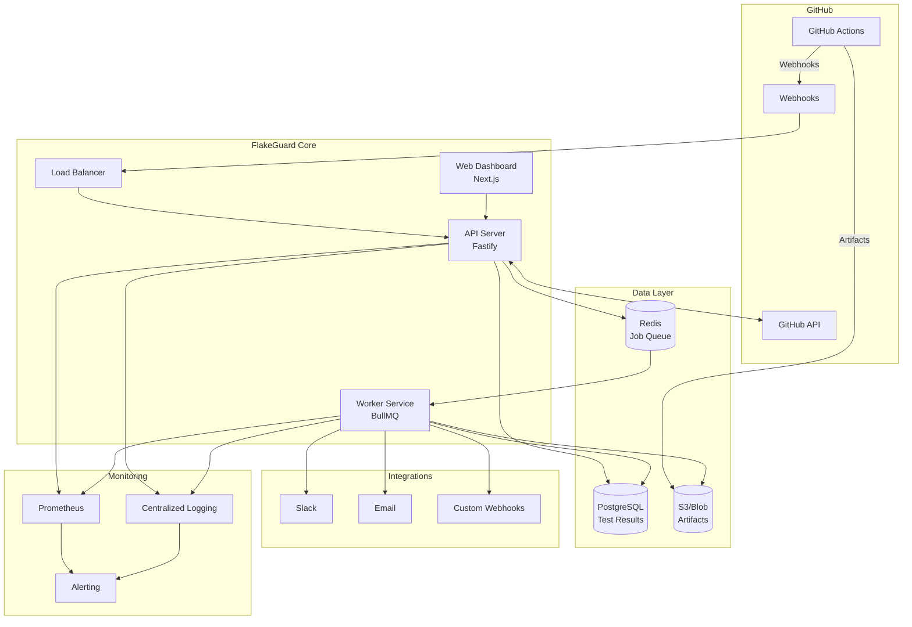
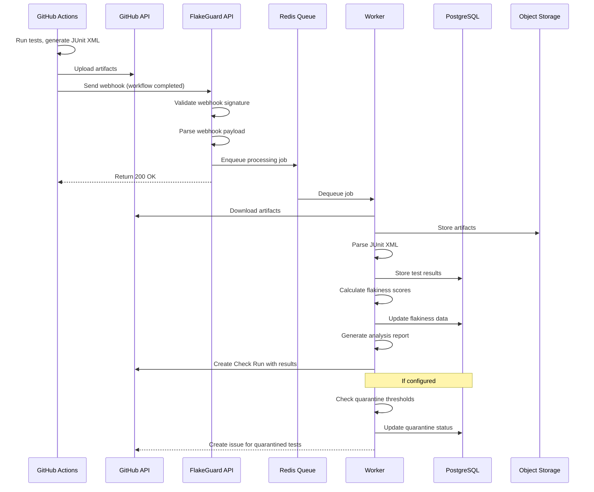
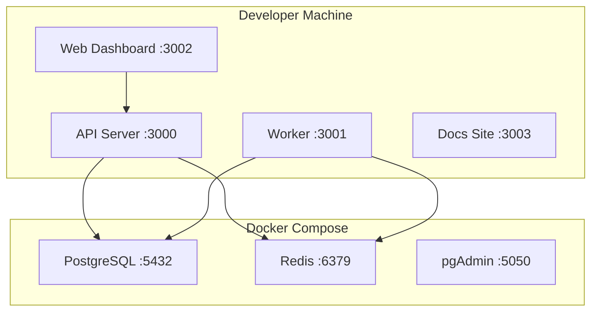
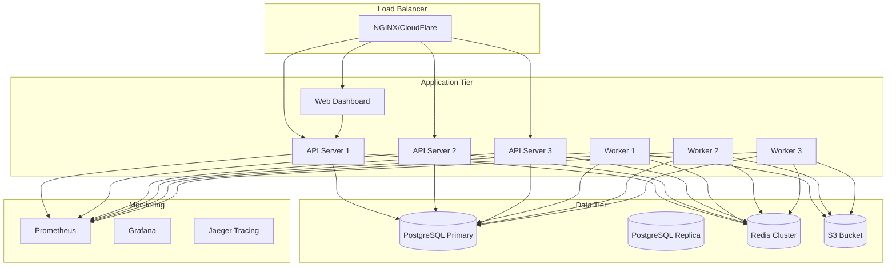
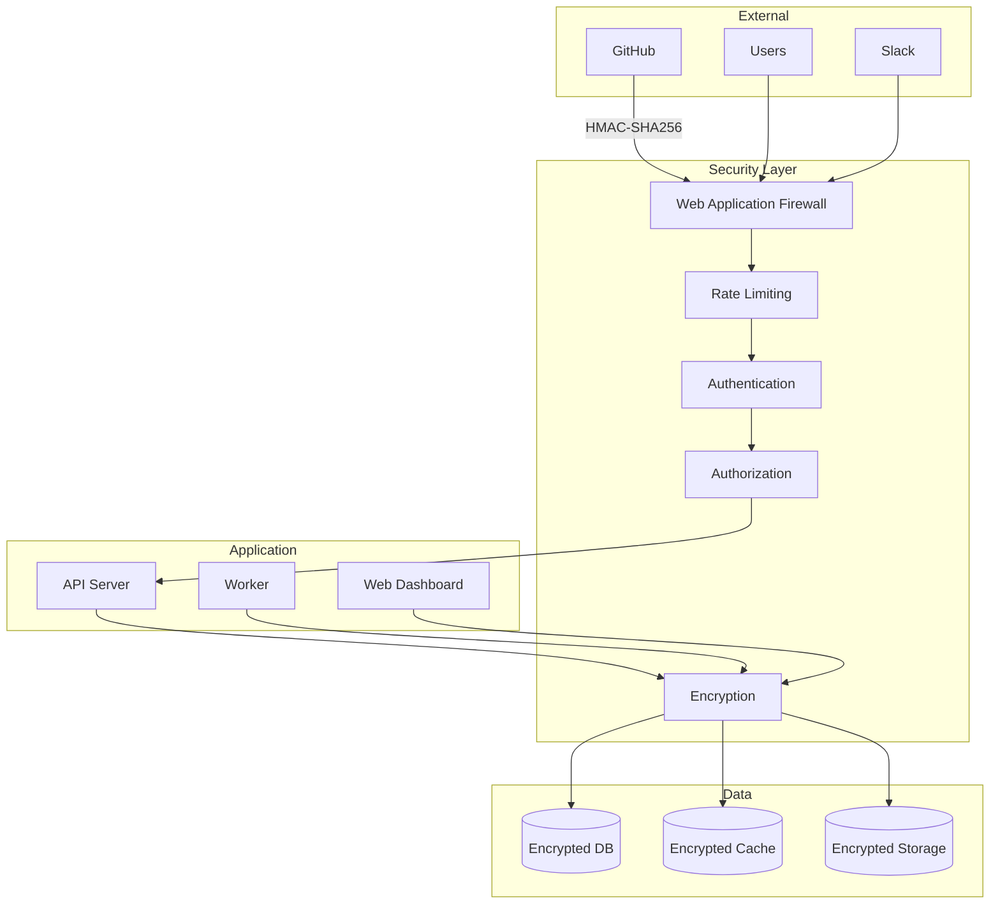

# Architecture Overview

FlakeGuard is designed as a modern, scalable microservices architecture that processes test results from GitHub Actions workflows and provides intelligent flakiness detection and analysis.

## High-Level Architecture

## Core Components

### API Server (Fastify)
The central hub that handles:
- **GitHub Webhook Processing** - Receives and validates GitHub events
- **REST API Endpoints** - Provides data access for clients
- **Authentication & Authorization** - Secures access to resources
- **Rate Limiting** - Prevents abuse and ensures stability
- **Request Validation** - Validates all incoming requests using Zod schemas

### Worker Service (BullMQ)
Background job processor that handles:
- **Artifact Download** - Retrieves JUnit XML files from GitHub
- **Test Result Parsing** - Extracts test data from various formats
- **Flakiness Analysis** - Runs detection algorithms on test data
- **Report Generation** - Creates comprehensive analysis reports
- **Integration Processing** - Sends notifications to external services

### Web Dashboard (Next.js)
User interface providing:
- **Test Analytics** - Visual dashboards and trends
- **Repository Management** - Configure settings per repository
- **Quarantine Management** - Review and manage quarantined tests
- **User Management** - Team access and permissions

### Data Storage

#### PostgreSQL
Primary database storing:
- **Test Results** - Individual test executions and outcomes
- **Flakiness Scores** - Calculated flakiness metrics over time
- **Repository Metadata** - Configuration and settings
- **User Data** - Authentication and authorization information
- **Audit Logs** - System activity and changes

#### Redis
High-performance cache and queue system:
- **Job Queue** - BullMQ job processing
- **Session Storage** - User sessions and temporary data
- **Rate Limiting** - Request throttling counters
- **Caching** - Frequently accessed data

#### Object Storage (S3/Blob)
File storage for:
- **Test Artifacts** - Downloaded JUnit XML files
- **Generated Reports** - HTML and JSON analysis reports
- **Backups** - Database and configuration backups

## Data Flow Architecture

## Deployment Architectures

### Development Environment

### Production Environment

## Technology Stack

### Backend Services

| Component | Technology | Purpose |
|-----------|------------|---------|
| **Runtime** | Node.js 20+ | JavaScript/TypeScript execution |
| **API Framework** | Fastify 4 | High-performance web framework |
| **Worker Queue** | BullMQ | Reliable job processing |
| **Database ORM** | Prisma 5 | Type-safe database access |
| **Validation** | Zod | Runtime type validation |
| **Logging** | Pino | High-performance logging |

### Data Storage

| Component | Technology | Purpose |
|-----------|------------|---------|
| **Primary Database** | PostgreSQL 16 | ACID transactions, complex queries |
| **Cache & Queue** | Redis 7 | High-performance caching and queuing |
| **Object Storage** | S3/Compatible | Scalable file storage |
| **Search** | PostgreSQL Full-Text | Test result search and filtering |

### Frontend & Documentation

| Component | Technology | Purpose |
|-----------|------------|---------|
| **Web Dashboard** | Next.js 14 | React-based web application |
| **Documentation** | Docusaurus 3 | Developer documentation site |
| **UI Components** | Tailwind CSS | Utility-first styling |
| **Charts & Analytics** | Recharts | Data visualization |

### DevOps & Monitoring

| Component | Technology | Purpose |
|-----------|------------|---------|
| **Containerization** | Docker | Application packaging |
| **Orchestration** | Docker Compose/K8s | Service deployment |
| **Monitoring** | Prometheus | Metrics collection |
| **Visualization** | Grafana | Metrics dashboards |
| **Tracing** | Jaeger | Distributed tracing |
| **Logging** | ELK Stack | Centralized log management |

## Security Architecture

### Security Features

- **Webhook Signature Validation** - HMAC-SHA256 verification of GitHub webhooks
- **JWT Authentication** - Stateless authentication for API access
- **Role-Based Access Control** - Granular permissions for different user roles
- **Rate Limiting** - Per-endpoint and per-user request throttling
- **Input Validation** - Comprehensive validation using Zod schemas
- **Encryption at Rest** - Database and file encryption
- **Encryption in Transit** - TLS 1.3 for all communication
- **Audit Logging** - Complete audit trail of all system activities

## Scalability Considerations

### Horizontal Scaling

- **API Servers** - Stateless design allows unlimited horizontal scaling
- **Workers** - Multiple worker instances can process jobs in parallel
- **Database Reads** - Read replicas for analytics and reporting queries
- **Caching** - Redis clustering for high-availability caching

### Performance Optimization

- **Connection Pooling** - Optimized database connection management
- **Query Optimization** - Indexed queries and efficient data access patterns  
- **Lazy Loading** - On-demand data loading in the web interface
- **CDN Integration** - Static asset delivery via CDN
- **Compression** - Gzip/Brotli compression for all HTTP responses

### Resource Management

- **Memory Management** - Efficient memory usage patterns
- **CPU Optimization** - Non-blocking I/O and efficient algorithms
- **Disk I/O** - Optimized database queries and file operations
- **Network** - Minimal data transfer and efficient protocols

This architecture ensures FlakeGuard can scale from small teams to enterprise deployments while maintaining reliability, security, and performance.

## Next Steps

- [System Design Details](./system-design.md)
- [Component Relationships](./component-diagram.md)
- [Data Flow Patterns](./data-flow.md)
- [Sequence Diagrams](./sequence-diagrams.md)