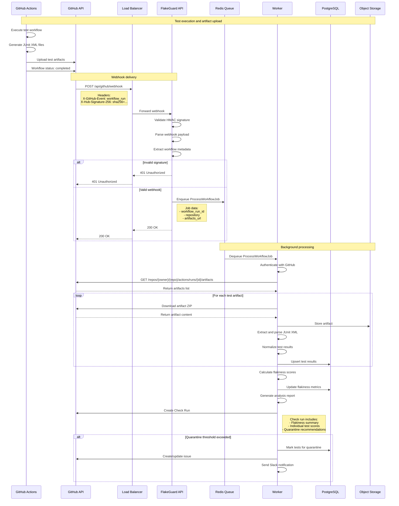
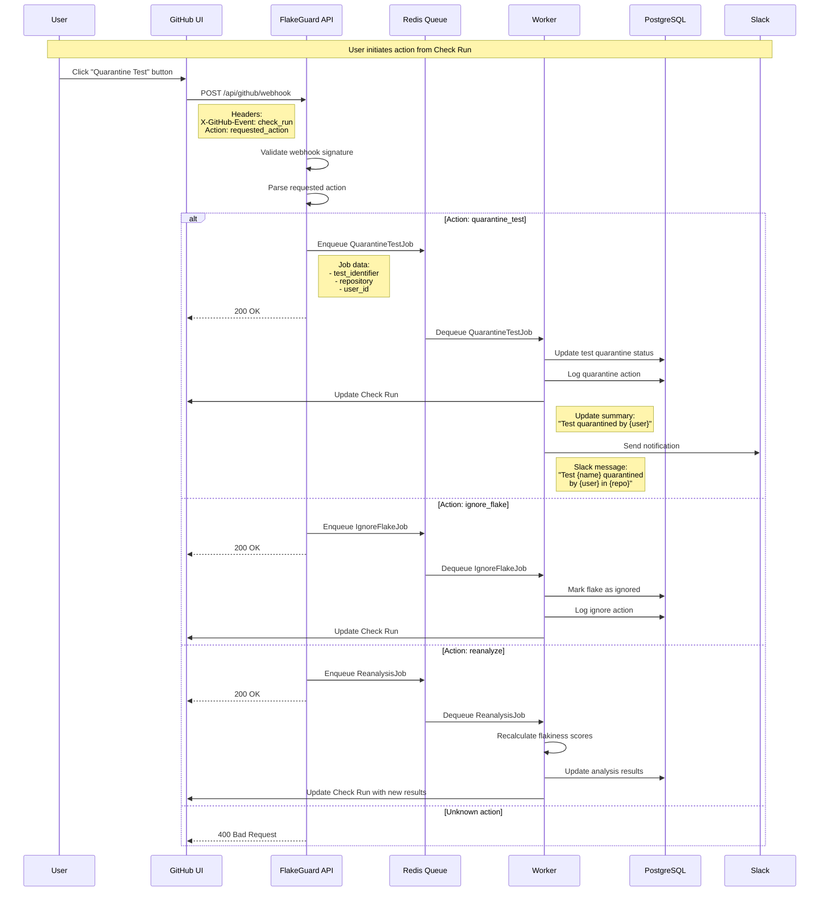
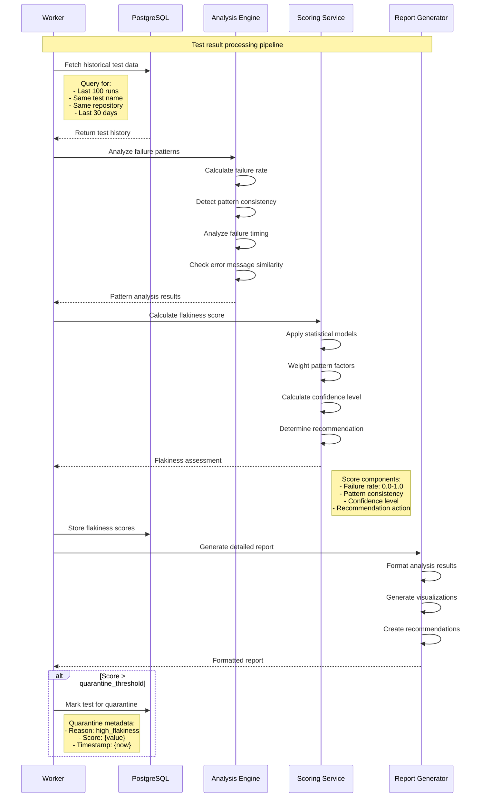
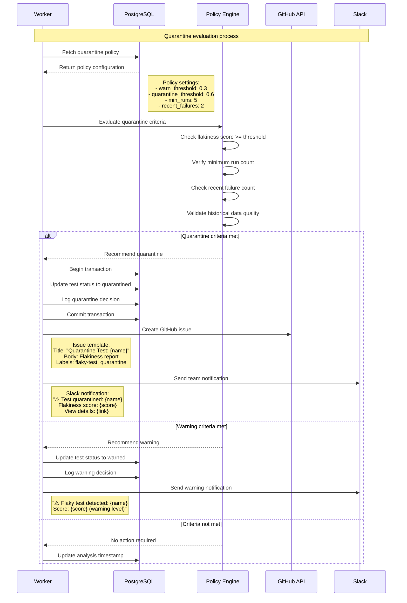
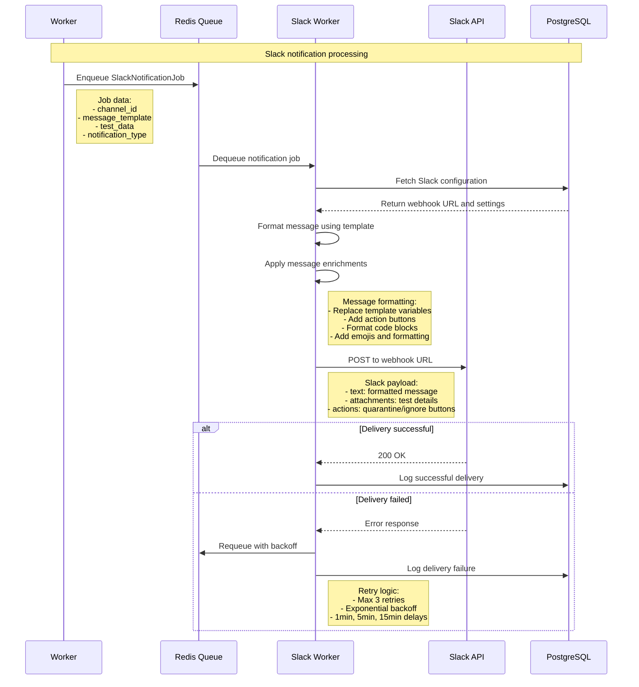
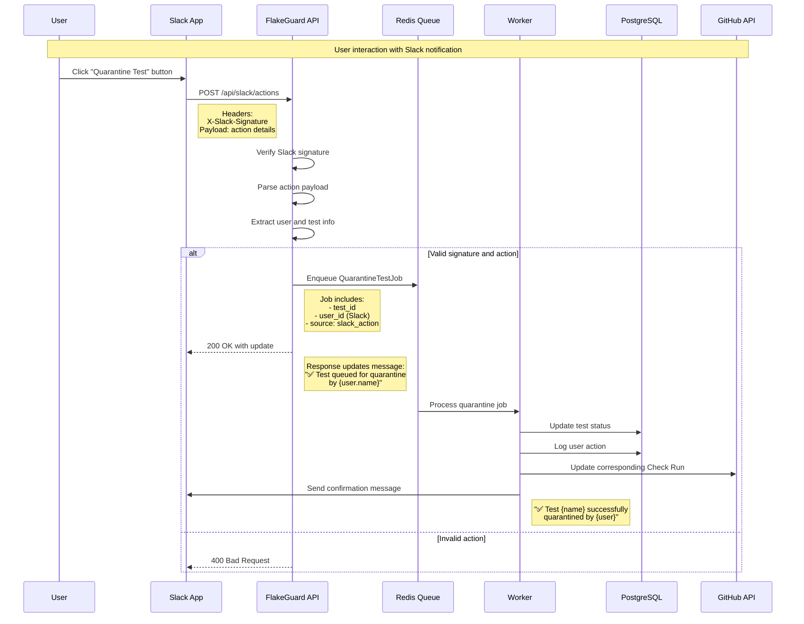

# Sequence Diagrams

This document provides detailed sequence diagrams showing how FlakeGuard processes different types of events and workflows.

## Webhook Processing Flow

### GitHub Workflow Completion



### Check Run Requested Action Flow



## Flakiness Detection Pipeline

### Test Result Analysis



### Quarantine Decision Flow



## Slack Integration Flow

### Notification Delivery



### Interactive Action Handling



## Error Handling and Recovery

### Webhook Processing Failures

```mermaid
sequenceDiagram
    participant GH as GitHub
    participant API as FlakeGuard API
    participant Q as Redis Queue
    participant W as Worker
    participant DLQ as Dead Letter Queue
    participant ALERT as Alerting
    
    Note over GH,ALERT: Error handling in webhook processing
    GH->>API: POST /api/github/webhook
    
    alt Processing error
        API->>API: Processing fails
        API->>Q: Enqueue job with retry metadata
        API-->>GH: 500 Internal Server Error
        
        Note right of GH: GitHub retries:<br/>- Exponential backoff<br/>- Up to 5 attempts<br/>- 15min, 30min, 1hr, 2hr, 4hr
        
        Q->>W: Attempt job processing
        W->>W: Processing fails again
        W->>Q: Requeue with incremented retry count
        
        loop Until max retries
            Q->>W: Retry job processing
            
            alt Processing succeeds
                W->>W: Complete successfully
                break
            else Still failing
                W->>Q: Increment retry count
            end
        end
        
        alt Max retries exceeded
            Q->>DLQ: Move to dead letter queue
            DLQ->>ALERT: Trigger alert
            Note right of ALERT: Alert includes:<br/>- Webhook details<br/>- Error messages<br/>- Retry history
        end
        
    else Validation error
        API-->>GH: 400 Bad Request
        Note right of API: Don't retry validation errors
    end
```

### Service Recovery Patterns

```mermaid
sequenceDiagram
    participant LB as Load Balancer
    participant API1 as API Instance 1
    participant API2 as API Instance 2
    participant DB as PostgreSQL
    participant MONITOR as Health Monitor
    
    Note over LB,MONITOR: Service failure and recovery
    LB->>API1: Health check request
    
    alt Service healthy
        API1-->>LB: 200 OK
        
    else Service unhealthy
        API1-->>LB: 503 Service Unavailable
        LB->>API2: Route traffic to healthy instance
        
        MONITOR->>MONITOR: Detect unhealthy service
        MONITOR->>API1: Attempt service restart
        
        loop Until healthy or max attempts
            MONITOR->>API1: Check service status
            
            alt Service recovered
                API1-->>MONITOR: 200 OK
                MONITOR->>LB: Add instance back to pool
                break
            else Still unhealthy
                MONITOR->>MONITOR: Wait before retry
            end
        end
        
        alt Recovery failed
            MONITOR->>MONITOR: Escalate to on-call team
        end
    end
```

This comprehensive set of sequence diagrams provides detailed visibility into FlakeGuard's operational flows, helping developers understand the system behavior and troubleshoot issues effectively.

## Related Documentation

- [Architecture Overview](./overview.md)
- [Troubleshooting Guide](../troubleshooting/debugging-guide.md)
- [Webhook Processing](../concepts/webhook-processing.md)
- [Monitoring & Alerting](../monitoring/alerting.md)