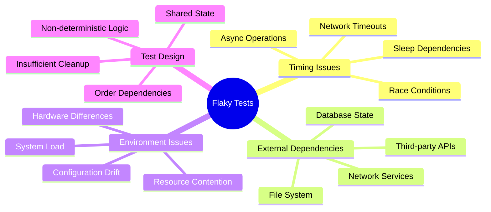
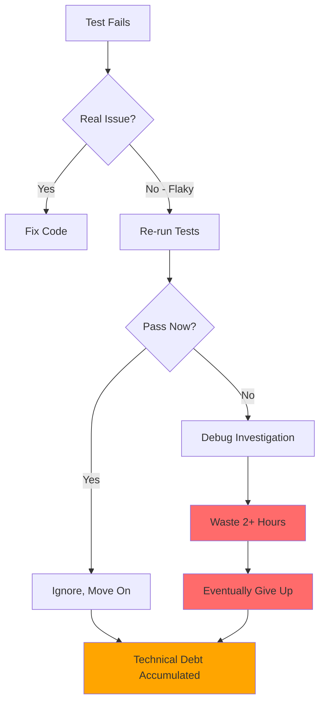
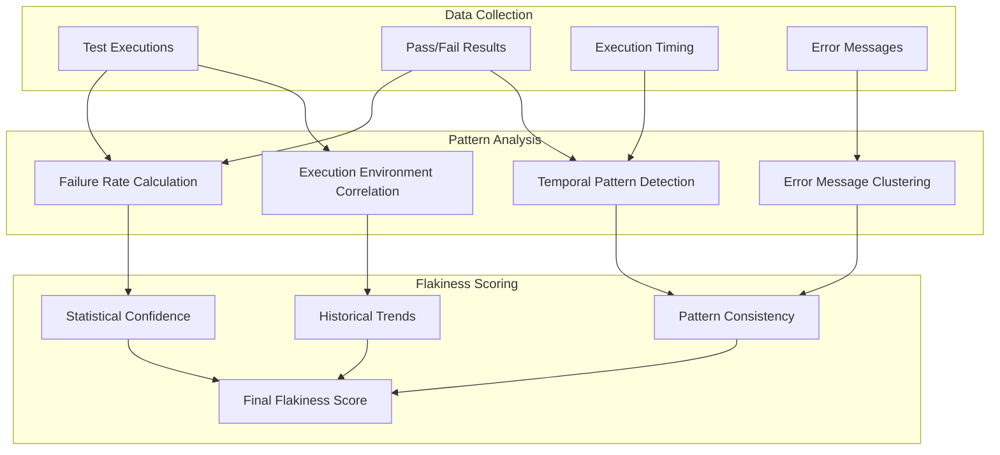

# Understanding Flaky Tests

Flaky tests are tests that exhibit inconsistent behavior - they may pass or fail without any changes to the code being tested. This unpredictability makes them one of the most frustrating aspects of maintaining a reliable CI/CD pipeline.

## What Makes a Test Flaky?

### Common Causes of Flakiness



#### 1. Timing and Concurrency Issues

**Race Conditions**: Tests that depend on the execution order of concurrent operations
```javascript
// ❌ Flaky: Depends on async timing
test('should update user after save', async () => {
  const user = new User({ name: 'John' });
  user.save(); // No await!
  
  const updated = await User.findById(user.id);
  expect(updated.name).toBe('John'); // May fail if save isn't complete
});

// ✅ Stable: Properly awaited
test('should update user after save', async () => {
  const user = new User({ name: 'John' });
  await user.save(); // Properly awaited
  
  const updated = await User.findById(user.id);
  expect(updated.name).toBe('John');
});
```

**Arbitrary Timeouts**: Tests using fixed delays instead of waiting for conditions
```javascript
// ❌ Flaky: Fixed timeout
test('should load data', async () => {
  loadData();
  await sleep(1000); // What if it takes longer?
  expect(getData()).toBeDefined();
});

// ✅ Stable: Wait for condition
test('should load data', async () => {
  loadData();
  await waitFor(() => getData(), { timeout: 5000 });
  expect(getData()).toBeDefined();
});
```

#### 2. External Dependencies

**Database State**: Tests that assume specific database state
```sql
-- ❌ Flaky: Assumes specific ID
SELECT * FROM users WHERE id = 123;

-- ✅ Stable: Uses created test data
SELECT * FROM users WHERE email = 'test@example.com';
```

**File System Dependencies**: Tests that read/write files without proper cleanup
```python
# ❌ Flaky: File may exist from previous runs
def test_create_config():
    assert not os.path.exists('config.json')
    create_config()
    assert os.path.exists('config.json')

# ✅ Stable: Clean up before and after
def test_create_config():
    if os.path.exists('config.json'):
        os.remove('config.json')
    
    create_config()
    assert os.path.exists('config.json')
    
    os.remove('config.json')  # Cleanup
```

#### 3. Non-deterministic Logic

**Random Values**: Tests that use random data without controlling randomness
```java
// ❌ Flaky: Random values
@Test
public void testSorting() {
    List<Integer> numbers = generateRandomNumbers(100);
    sort(numbers);
    assertTrue(isSorted(numbers));
}

// ✅ Stable: Fixed seed or known data
@Test
public void testSorting() {
    List<Integer> numbers = Arrays.asList(3, 1, 4, 1, 5);
    sort(numbers);
    assertEquals(Arrays.asList(1, 1, 3, 4, 5), numbers);
}
```

**Date/Time Dependencies**: Tests that depend on current time
```javascript
// ❌ Flaky: Depends on current time
test('should create recent post', () => {
  const post = createPost();
  const now = new Date();
  expect(post.createdAt.getTime()).toBeCloseTo(now.getTime(), -2);
});

// ✅ Stable: Mock or control time
test('should create recent post', () => {
  const mockDate = new Date('2024-01-01T12:00:00Z');
  jest.useFakeTimers().setSystemTime(mockDate);
  
  const post = createPost();
  expect(post.createdAt).toEqual(mockDate);
});
```

## The Impact of Flaky Tests

### Developer Productivity Loss



### Quantified Impact

Based on industry research, flaky tests cause:

- **25% increase** in CI/CD pipeline duration
- **40% of developer time** spent on false positive investigations
- **60% reduction** in team confidence in test results
- **$50,000+ annually** in lost productivity for a team of 10 developers

### Business Consequences

1. **Delayed Releases**: Teams wait for "green builds" that never come reliably
2. **Reduced Quality**: Important failures get masked by flaky test noise
3. **Technical Debt**: Workarounds accumulate instead of proper fixes
4. **Team Morale**: Developers lose trust in the testing system

## FlakeGuard's Detection Approach

### Statistical Analysis

FlakeGuard uses multiple statistical models to identify flaky tests:



#### 1. Failure Rate Analysis

Basic failure rate calculation with statistical significance:

```typescript
interface FailureRateAnalysis {
  totalRuns: number;
  failures: number;
  failureRate: number;
  confidenceInterval: [number, number];
  statisticalSignificance: number;
}

function calculateFailureRate(results: TestResult[]): FailureRateAnalysis {
  const totalRuns = results.length;
  const failures = results.filter(r => r.status === 'failed').length;
  const failureRate = failures / totalRuns;
  
  // Wilson score interval for confidence
  const z = 1.96; // 95% confidence
  const n = totalRuns;
  const p = failureRate;
  
  const denominator = 1 + z * z / n;
  const centre = (p + z * z / (2 * n)) / denominator;
  const offset = z * Math.sqrt((p * (1 - p) + z * z / (4 * n)) / n) / denominator;
  
  return {
    totalRuns,
    failures,
    failureRate,
    confidenceInterval: [centre - offset, centre + offset],
    statisticalSignificance: Math.min(1, totalRuns / 30) // Need 30+ runs for high confidence
  };
}
```

#### 2. Temporal Pattern Detection

Analyze failure patterns over time to identify intermittent issues:

```typescript
interface TemporalPattern {
  streakLength: number;
  alternatingPattern: boolean;
  timeOfDayCorrelation: number;
  weekdayCorrelation: number;
  recentTrend: 'improving' | 'degrading' | 'stable';
}

function analyzeTemporalPatterns(results: TestResult[]): TemporalPattern {
  const chronological = results.sort((a, b) => a.timestamp.getTime() - b.timestamp.getTime());
  
  // Detect streaks
  let currentStreak = 1;
  let maxStreak = 1;
  for (let i = 1; i < chronological.length; i++) {
    if (chronological[i].status === chronological[i-1].status) {
      currentStreak++;
      maxStreak = Math.max(maxStreak, currentStreak);
    } else {
      currentStreak = 1;
    }
  }
  
  // Detect alternating patterns
  const alternating = checkAlternatingPattern(chronological);
  
  // Time-based correlations
  const timeCorrelation = analyzeTimeCorrelation(chronological);
  const dayCorrelation = analyzeDayCorrelation(chronological);
  
  // Recent trend analysis
  const recentTrend = analyzeRecentTrend(chronological);
  
  return {
    streakLength: maxStreak,
    alternatingPattern: alternating,
    timeOfDayCorrelation: timeCorrelation,
    weekdayCorrelation: dayCorrelation,
    recentTrend
  };
}
```

#### 3. Error Message Analysis

Cluster error messages to identify consistent vs inconsistent failure modes:

```typescript
interface ErrorAnalysis {
  uniqueErrorTypes: number;
  dominantErrorType: string;
  errorConsistency: number; // 0-1, higher means more consistent
  errorClusters: ErrorCluster[];
}

function analyzeErrorMessages(results: TestResult[]): ErrorAnalysis {
  const failures = results.filter(r => r.status === 'failed' && r.errorMessage);
  
  if (failures.length === 0) {
    return { uniqueErrorTypes: 0, dominantErrorType: '', errorConsistency: 1, errorClusters: [] };
  }
  
  // Use string similarity to cluster error messages
  const clusters = clusterErrorMessages(failures.map(f => f.errorMessage));
  const largestCluster = clusters.reduce((max, cluster) => 
    cluster.size > max.size ? cluster : max
  );
  
  return {
    uniqueErrorTypes: clusters.length,
    dominantErrorType: largestCluster.representative,
    errorConsistency: largestCluster.size / failures.length,
    errorClusters: clusters
  };
}
```

### Flakiness Score Calculation

FlakeGuard combines multiple signals into a single flakiness score:

```typescript
interface FlakinessScore {
  overall: number;        // 0-1, overall flakiness score
  confidence: number;     // 0-1, confidence in the assessment
  recommendation: 'stable' | 'monitor' | 'investigate' | 'quarantine';
  components: {
    failureRate: number;
    temporalConsistency: number;
    errorConsistency: number;
    statisticalSignificance: number;
  };
}

function calculateFlakinessScore(
  failureAnalysis: FailureRateAnalysis,
  temporalPattern: TemporalPattern,
  errorAnalysis: ErrorAnalysis
): FlakinessScore {
  const components = {
    failureRate: calculateFailureRateScore(failureAnalysis),
    temporalConsistency: calculateTemporalScore(temporalPattern),
    errorConsistency: 1 - errorAnalysis.errorConsistency,
    statisticalSignificance: failureAnalysis.statisticalSignificance
  };
  
  // Weighted combination
  const weights = { failureRate: 0.4, temporalConsistency: 0.3, errorConsistency: 0.3 };
  const overall = Object.entries(components)
    .filter(([key]) => key !== 'statisticalSignificance')
    .reduce((sum, [key, value]) => sum + value * weights[key], 0);
  
  const confidence = components.statisticalSignificance;
  
  const recommendation = determineRecommendation(overall, confidence);
  
  return { overall, confidence, recommendation, components };
}
```

## Best Practices for Test Stability

### 1. Design for Determinism

```typescript
// ✅ Use dependency injection for controllability
class UserService {
  constructor(
    private database: Database,
    private timeProvider: TimeProvider,
    private idGenerator: IdGenerator
  ) {}
  
  async createUser(userData: UserData): Promise<User> {
    return this.database.create({
      ...userData,
      id: this.idGenerator.generate(),
      createdAt: this.timeProvider.now()
    });
  }
}

// Test with mocked dependencies
test('creates user with generated ID and timestamp', async () => {
  const mockTime = new Date('2024-01-01T12:00:00Z');
  const mockId = 'user-123';
  
  const service = new UserService(
    mockDatabase,
    { now: () => mockTime },
    { generate: () => mockId }
  );
  
  const user = await service.createUser({ name: 'John' });
  
  expect(user.id).toBe(mockId);
  expect(user.createdAt).toBe(mockTime);
});
```

### 2. Proper Async Handling

```typescript
// ✅ Wait for conditions, not arbitrary timeouts
async function waitForCondition<T>(
  condition: () => T | Promise<T>,
  options: { timeout: number; interval?: number } = { timeout: 5000, interval: 100 }
): Promise<T> {
  const start = Date.now();
  
  while (Date.now() - start < options.timeout) {
    try {
      const result = await condition();
      if (result) return result;
    } catch (error) {
      // Condition not met yet, continue waiting
    }
    
    await sleep(options.interval || 100);
  }
  
  throw new Error(`Condition not met within ${options.timeout}ms`);
}

// Usage
test('data loads successfully', async () => {
  loadData();
  
  const data = await waitForCondition(
    () => getData(),
    { timeout: 10000 }
  );
  
  expect(data).toBeDefined();
});
```

### 3. Isolated Test Data

```sql
-- ✅ Use unique test data for each test
CREATE TABLE test_users_${TEST_RUN_ID} (
  id SERIAL PRIMARY KEY,
  email VARCHAR(255) UNIQUE,
  name VARCHAR(255)
);

-- Clean up after tests
DROP TABLE IF EXISTS test_users_${TEST_RUN_ID};
```

### 4. Proper Error Handling

```typescript
// ✅ Handle expected exceptions gracefully
test('handles network timeout gracefully', async () => {
  const mockFetch = jest.fn().mockRejectedValue(new Error('Network timeout'));
  
  const result = await fetchWithRetry('https://api.example.com/data', {
    maxRetries: 3,
    timeout: 1000
  });
  
  expect(result.error).toBe('Network timeout');
  expect(mockFetch).toHaveBeenCalledTimes(4); // Initial + 3 retries
});
```

## Monitoring Test Health

### Flakiness Metrics to Track

1. **Flakiness Rate**: Percentage of tests identified as flaky
2. **Test Stability Score**: Overall reliability of test suite
3. **Mean Time to Detect (MTTD)**: How quickly flaky tests are identified
4. **Mean Time to Fix (MTTF)**: Average time to resolve flaky tests
5. **False Positive Rate**: CI failures not caused by code changes

### Setting Up Alerts

```yaml
# Example alerting configuration
alerts:
  - name: "High Flakiness Rate"
    condition: "flakiness_rate > 0.05"  # More than 5% of tests are flaky
    severity: "warning"
    
  - name: "Critical Test Instability"
    condition: "test_stability_score < 0.9"  # Less than 90% stable
    severity: "critical"
    
  - name: "Flaky Test Backlog Growing"
    condition: "unresolved_flaky_tests > 50"
    severity: "warning"
```

By understanding the root causes of flaky tests and implementing proper detection and remediation strategies, teams can significantly improve their CI/CD reliability and developer productivity.

## Related Documentation

- [Scoring Algorithm](./scoring-algorithm.md)
- [Quarantine System](./quarantine-system.md) 
- [Webhook Processing](./webhook-processing.md)
- [Common Issues](../troubleshooting/common-issues.md)