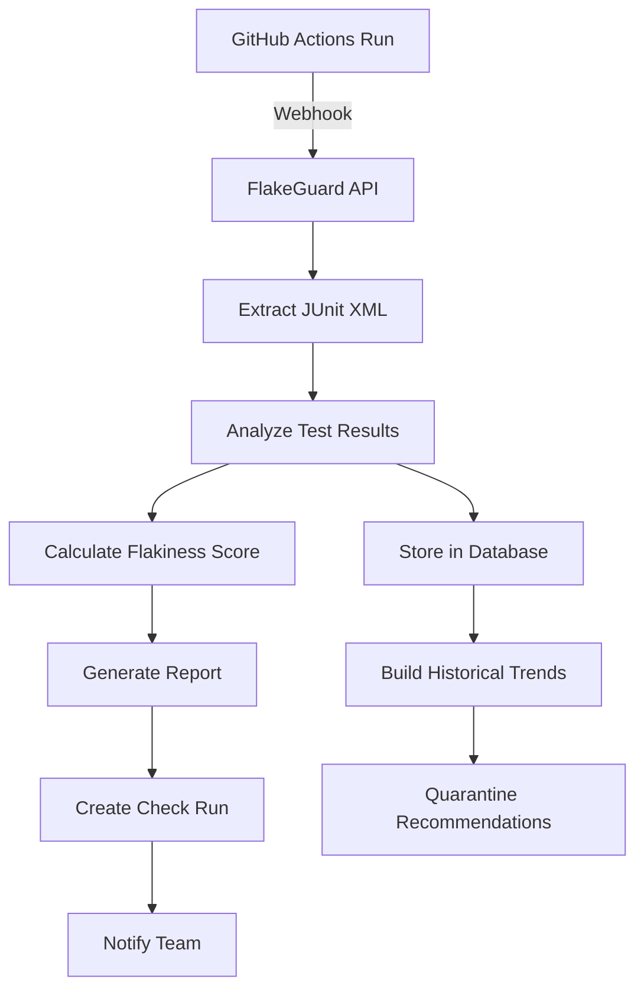

# Introduction to FlakeGuard

Welcome to FlakeGuard, a production-grade system for detecting, monitoring, and managing flaky tests in your CI/CD pipeline. FlakeGuard helps development teams identify unreliable tests, understand their impact, and take informed action to improve test suite reliability.

## What are Flaky Tests?

Flaky tests are tests that exhibit inconsistent behavior - they may pass or fail without any changes to the code being tested. Common causes include:

- **Race conditions**: Tests that depend on timing or execution order
- **External dependencies**: Network calls, file system operations, or database state
- **Non-deterministic code**: Random number generation, date/time dependencies
- **Resource contention**: Tests competing for limited resources
- **Test isolation issues**: Tests that affect each other's state

## Why FlakeGuard?

### The Problem

Flaky tests are a significant productivity drain:
- Developers waste time re-running failing builds
- CI/CD pipelines become unreliable
- Teams lose confidence in their test suite
- Important failures get masked by flaky test noise
- Deployment velocity decreases

### The Solution

FlakeGuard provides:

1. **Automated Detection**: Advanced algorithms analyze test execution patterns to identify flaky tests
2. **Intelligent Scoring**: Sophisticated flakiness scoring with confidence levels and actionable recommendations
3. **GitHub Integration**: Seamless integration with GitHub Actions via GitHub App
4. **Real-time Analytics**: Track test reliability trends over time
5. **Quarantine Management**: Automatically suggest tests for quarantine based on flakiness patterns

## Key Features

### 🔍 **Automated Flake Detection**
- Pattern recognition across multiple test runs
- Statistical analysis of pass/fail ratios
- Confidence scoring for detected flakes

### 📊 **Comprehensive Analytics**
- Test reliability trends over time
- Repository and branch-level insights
- Detailed failure pattern analysis

### 🔗 **Seamless Integration**
- GitHub Actions webhook processing
- JUnit XML support for all major testing frameworks
- RESTful API for custom integrations

### ⚡ **Real-time Processing**
- Instant analysis of test results
- Live updates via webhooks
- Background job processing with BullMQ

### 🛡️ **Production-Ready**
- Built with TypeScript and modern Node.js
- Comprehensive monitoring and observability
- Security-first design with webhook verification

## How It Works

### Process Flow

1. **Test Execution**: Your CI/CD pipeline runs tests and generates JUnit XML reports
2. **Webhook Processing**: GitHub sends webhooks to FlakeGuard when workflows complete
3. **Artifact Analysis**: FlakeGuard extracts and parses test results from artifacts
4. **Flakiness Detection**: Advanced algorithms analyze patterns across multiple runs
5. **Scoring & Reporting**: Generate detailed reports with actionable recommendations
6. **Integration**: Results are delivered via GitHub Check Runs, Slack notifications, or API

## Getting Started

Ready to improve your test reliability? Follow our [Quick Start Guide](./quick-start.md) to get FlakeGuard running in minutes.

### Prerequisites

- Node.js 20+ and pnpm 8+
- PostgreSQL 16+ for data storage
- Redis 7+ for job queue management
- GitHub repository with Actions enabled

### Next Steps

1. [Quick Start](./quick-start.md) - Get FlakeGuard running locally
2. [Installation](./installation.md) - Production deployment options
3. [GitHub App Setup](./github-app-setup.md) - Configure GitHub integration
4. [Configuration](./configuration.md) - Customize behavior and policies

## Community & Support

- **Documentation**: You're reading it!
- **GitHub Issues**: [Report bugs and request features](https://github.com/flakeguard/flakeguard/issues)
- **Discussions**: [Join the community](https://github.com/flakeguard/flakeguard/discussions)
- **Security**: Report vulnerabilities via our [Security Policy](https://github.com/flakeguard/flakeguard/security)

---

**FlakeGuard** - Making your tests more reliable, one flake at a time.