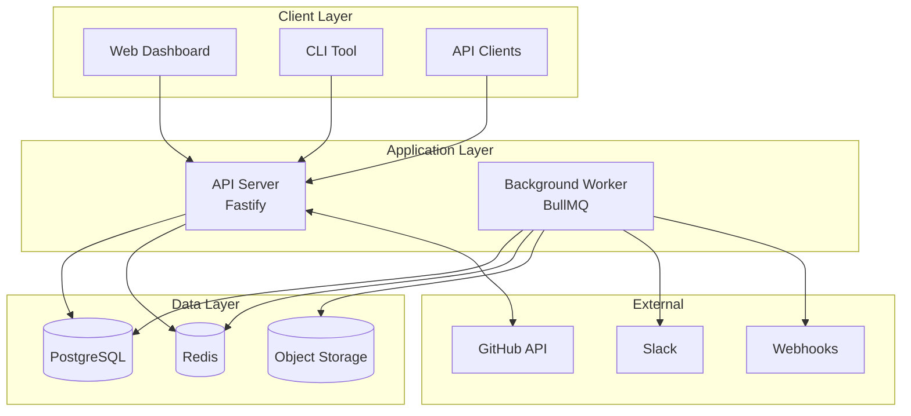

# Welcome to FlakeGuard

**Making your tests more reliable, one flake at a time.**

FlakeGuard is a production-grade system for detecting, monitoring, and managing flaky tests in your CI/CD pipeline. It integrates seamlessly with GitHub Actions to automatically analyze test results, identify unreliable tests, and provide actionable recommendations for improving test suite reliability.

## Why FlakeGuard?

Flaky tests are a major productivity drain for development teams:
- **Developers waste time** re-running failing builds
- **CI/CD pipelines become unreliable** with inconsistent results  
- **Teams lose confidence** in their test suite
- **Important failures get masked** by flaky test noise
- **Deployment velocity decreases** due to unreliable signals

FlakeGuard solves these problems with intelligent automation and deep insights.

## Key Features

### 🔍 **Automated Flake Detection**
Advanced algorithms analyze test execution patterns across multiple runs to identify flaky tests with high confidence.

### 📊 **Intelligent Scoring**
Sophisticated flakiness scoring system provides confidence levels and actionable recommendations for each test.

### 🔗 **GitHub Integration** 
Seamless integration with GitHub Actions via GitHub App. No workflow changes required.

### 📈 **Real-time Analytics**
Track test reliability trends over time with comprehensive dashboards and reporting.

### 🛡️ **Quarantine Management**
Automatically suggest tests for quarantine based on configurable flakiness policies.

### 🚀 **Production Ready**
Built with TypeScript, modern Node.js, and enterprise-grade security and monitoring.

## How It Works


1. **Your tests run** in GitHub Actions and generate JUnit XML reports
2. **FlakeGuard receives webhooks** when workflows complete
3. **Test results are analyzed** using statistical algorithms  
4. **Flakiness scores are calculated** with confidence levels
5. **Detailed reports are generated** with actionable recommendations
6. **Results appear as Check Runs** on your commits and pull requests

## Quick Start

Get FlakeGuard running in under 10 minutes:

### 1. Start with Docker Compose

```bash
git clone https://github.com/flakeguard/flakeguard.git
cd flakeguard
cp .env.example .env
docker-compose up -d
pnpm install && pnpm migrate:dev && pnpm dev
```

### 2. Create GitHub App

[Set up a GitHub App](./getting-started/github-app-setup.md) to connect FlakeGuard with your repositories.

### 3. Add to Your Workflow

No changes needed! FlakeGuard automatically processes test artifacts from your existing workflows.

### 4. View Results

Check runs appear automatically on commits with detailed flakiness analysis and recommendations.

[**→ Get Started Now**](./getting-started/quick-start.md)

## Architecture Overview

FlakeGuard uses a modern microservices architecture designed for scalability and reliability:



**Core Components:**
- **API Server** - Fastify-based REST API handling webhooks and requests
- **Background Worker** - BullMQ-powered job processor for analysis tasks
- **PostgreSQL** - Primary database for test results and analysis data
- **Redis** - Job queue and high-performance caching layer
- **Web Dashboard** - Next.js-based UI for analytics and management

[**→ Learn More About Architecture**](./architecture/overview.md)

## Documentation Sections

### 🚀 Getting Started
Perfect for new users who want to get FlakeGuard running quickly.
- [Introduction](./getting-started/introduction.md) - What is FlakeGuard?
- [Quick Start](./getting-started/quick-start.md) - Up and running in 10 minutes  
- [Installation](./getting-started/installation.md) - Production deployment
- [GitHub App Setup](./getting-started/github-app-setup.md) - Connect to your repos

### 💡 Core Concepts  
Understand how FlakeGuard works under the hood.
- [Flaky Tests](./concepts/flaky-tests.md) - What makes tests flaky?
- [Scoring Algorithm](./concepts/scoring-algorithm.md) - How flakiness is calculated
- [Quarantine System](./concepts/quarantine-system.md) - Managing unreliable tests

### 🔧 Configuration & Deployment
Set up FlakeGuard for your environment.
- [Environment Variables](./configuration/environment-variables.md) - Configuration options
- [Docker Deployment](./deployment/docker.md) - Container deployment  
- [Kubernetes](./deployment/kubernetes.md) - Orchestrated deployment

### 🔒 Security & Compliance
Enterprise-grade security and compliance information.
- [Security Model](./security/security-model.md) - Threat model and protections
- [Authentication](./security/authentication.md) - User and service authentication
- [Data Protection](./security/data-protection.md) - Privacy and encryption

### 📊 Monitoring & Operations  
Keep FlakeGuard running smoothly in production.
- [SLOs & DORA Metrics](./monitoring/slos-dora.md) - Service objectives and DevOps metrics
- [Health Checks](./monitoring/health-checks.md) - System monitoring
- [Performance Tuning](./monitoring/performance.md) - Optimization guides

### 🔌 API Reference
Complete API documentation for integrations.
- [REST API](./api/introduction.md) - Complete REST API reference
- [GraphQL API](./api/graphql/overview.md) - GraphQL schema and queries
- [SDKs](./api/sdks/javascript.md) - Official client libraries

### 🆘 Troubleshooting
Resolve common issues and problems.
- [Common Issues](./troubleshooting/common-issues.md) - FAQ and quick fixes
- [Debugging Guide](./troubleshooting/debugging-guide.md) - Advanced troubleshooting
- [Performance Issues](./troubleshooting/performance-issues.md) - Performance debugging

## Use Cases

### Continuous Integration
- **Reduce CI/CD noise** from flaky test failures
- **Improve deployment confidence** with reliable test signals
- **Accelerate development velocity** by eliminating false failures

### Quality Assurance
- **Track test suite health** over time with comprehensive metrics
- **Identify problematic tests** before they impact the team
- **Prioritize test improvements** based on flakiness impact

### DevOps & Platform Engineering
- **Monitor system reliability** through test stability metrics
- **Integrate with existing toolchains** via APIs and webhooks
- **Scale testing infrastructure** with confidence

### Enterprise Compliance
- **Audit test reliability** for compliance requirements
- **Track improvement metrics** for engineering KPIs
- **Generate reports** for stakeholders and leadership

## Community & Support

### 🤝 Community
- [GitHub Discussions](https://github.com/flakeguard/flakeguard/discussions) - Community Q&A
- [Stack Overflow](https://stackoverflow.com/questions/tagged/flakeguard) - Technical questions
- [Discord Server](https://discord.gg/flakeguard) - Real-time chat

### 📝 Contributing  
- [Contributing Guide](./development/contributing.md) - How to contribute
- [Development Setup](./development/local-setup.md) - Local development
- [Architecture Decisions](./development/architecture-decisions.md) - Design decisions

### 🆘 Support
- [GitHub Issues](https://github.com/flakeguard/flakeguard/issues) - Bug reports and features
- [Security Issues](https://github.com/flakeguard/flakeguard/security) - Security vulnerabilities
- [Enterprise Support](mailto:enterprise@flakeguard.dev) - Commercial support

## What's Next?

Ready to eliminate flaky tests from your CI/CD pipeline? Here are the best next steps:

1. **📖 New to FlakeGuard?** Start with our [Introduction](./getting-started/introduction.md)
2. **🚀 Want to try it out?** Follow the [Quick Start Guide](./getting-started/quick-start.md)  
3. **🏢 Planning production deployment?** Check out [Installation Options](./getting-started/installation.md)
4. **🔌 Building integrations?** Explore the [API Documentation](./api/introduction.md)
5. **🎯 Enterprise features?** Learn about [Security & Compliance](./security/security-model.md)

---

**FlakeGuard** - Making your tests more reliable, one flake at a time.

*Built with ❤️ by developers who understand the pain of flaky tests.*