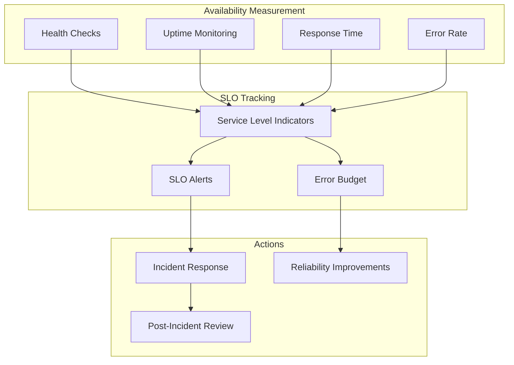
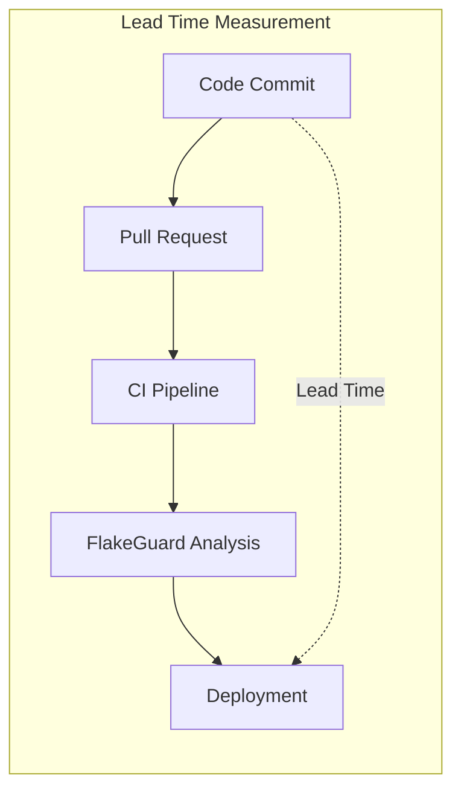
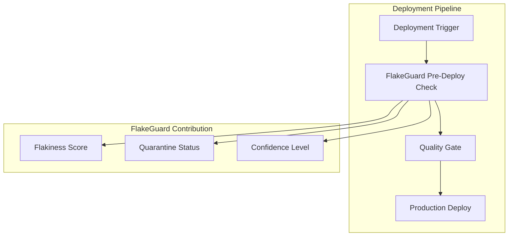
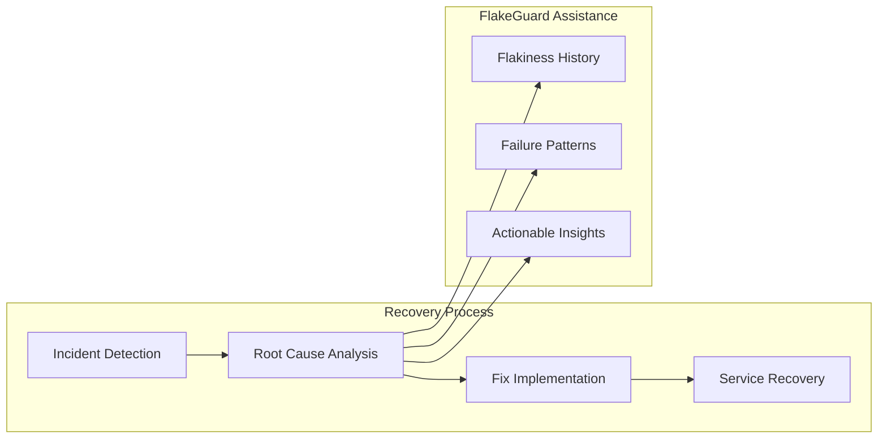
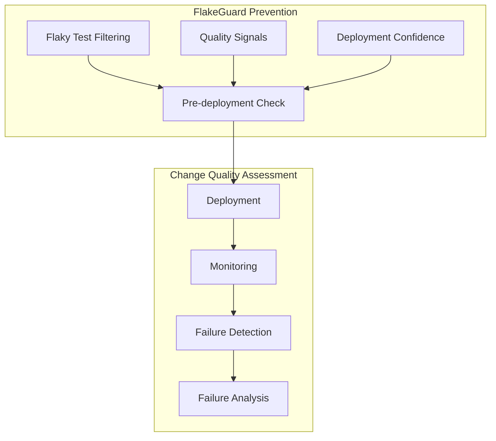
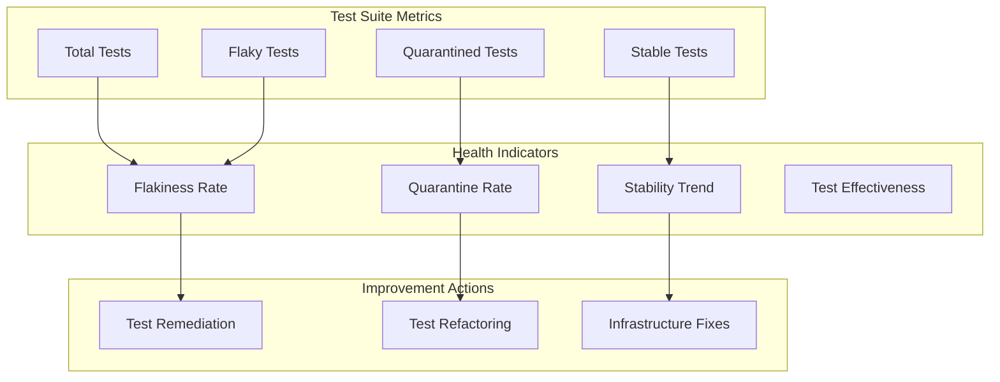
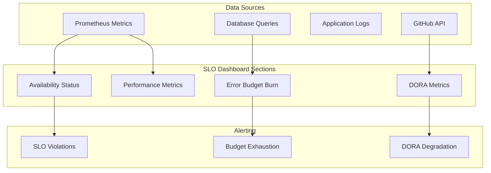
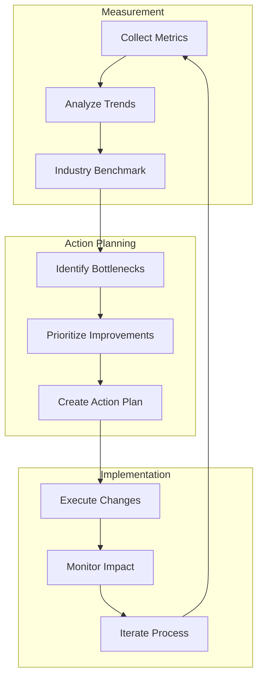

# SLOs & DORA Metrics Mapping

FlakeGuard implements comprehensive Service Level Objectives (SLOs) and maps to DevOps Research and Assessment (DORA) metrics to ensure reliable operation and continuous improvement of development velocity.

## Service Level Objectives (SLOs)

### System Availability SLOs

#### API Availability
- **Target**: 99.9% uptime (8.77 hours downtime/year)
- **Measurement Window**: 30-day rolling window
- **Error Budget**: 43.2 minutes/month



#### Webhook Processing SLOs
- **Target**: 99.95% successful webhook processing
- **Maximum Processing Time**: 95th percentile < 2 seconds
- **Queue Processing**: 99% of jobs processed within 5 minutes

```prometheus
# Availability SLI
(
  sum(rate(http_requests_total{status!~"5.."}[5m])) /
  sum(rate(http_requests_total[5m]))
) * 100

# Latency SLI  
histogram_quantile(0.95, 
  sum(rate(http_request_duration_seconds_bucket[5m])) by (le)
) < 2
```

### Performance SLOs

#### Response Time Targets

| Endpoint Category | 50th Percentile | 95th Percentile | 99th Percentile |
|------------------|-----------------|-----------------|-----------------|
| Health Checks | < 10ms | < 50ms | < 100ms |
| Webhook Processing | < 200ms | < 2s | < 5s |
| API Queries | < 100ms | < 500ms | < 1s |
| Analysis Jobs | < 30s | < 2min | < 5min |
| Report Generation | < 5s | < 30s | < 60s |

#### Throughput Targets
- **Webhook Ingestion**: 1,000 webhooks/minute
- **Concurrent Jobs**: 100 parallel analysis jobs
- **API Requests**: 10,000 requests/minute
- **Database Queries**: 50,000 queries/minute

### Data Quality SLOs

#### Test Result Processing
- **Parsing Success Rate**: 99.9% of JUnit XML files parsed successfully
- **Data Completeness**: 99.95% of test runs with complete metadata
- **Analysis Accuracy**: 99% confidence in flakiness detection

#### Historical Data Retention
- **Test Results**: 2 years of detailed history
- **Aggregated Metrics**: 5 years of trend data
- **Audit Logs**: 7 years for compliance
- **Backup Recovery**: 99.9% data recovery within 4 hours

## DORA Metrics Integration

FlakeGuard directly impacts and measures all four key DORA metrics:

### 1. Lead Time for Changes

**Definition**: Time from code commit to production deployment



**FlakeGuard Impact:**
- **Reduces lead time** by identifying flaky tests early
- **Prevents delays** caused by false positive test failures
- **Improves confidence** in automated deployments

**Measurement:**
```sql
-- Average lead time calculation
SELECT 
  AVG(
    EXTRACT(EPOCH FROM (deployment_time - commit_time)) / 3600
  ) as avg_lead_time_hours,
  DATE_TRUNC('week', deployment_time) as week
FROM deployments d
JOIN commits c ON d.commit_sha = c.sha
WHERE deployment_time > NOW() - INTERVAL '90 days'
GROUP BY week
ORDER BY week;
```

**Target**: < 2 hours for critical fixes, < 1 day for features

### 2. Deployment Frequency

**Definition**: How often code is deployed to production



**FlakeGuard Impact:**
- **Enables frequent deployments** by reducing test-related blockers
- **Improves deployment confidence** through flakiness insights
- **Reduces manual intervention** in CI/CD pipelines

**Measurement:**
```sql
-- Deployment frequency
SELECT 
  COUNT(*) as deployments_per_week,
  DATE_TRUNC('week', deployment_time) as week
FROM deployments 
WHERE deployment_time > NOW() - INTERVAL '90 days'
  AND status = 'success'
GROUP BY week
ORDER BY week;
```

**Target**: Multiple deployments per day

### 3. Mean Time to Recovery (MTTR)

**Definition**: Average time to recover from failures



**FlakeGuard Impact:**
- **Faster diagnosis** by distinguishing real failures from flaky tests
- **Reduced false alarms** leading to faster genuine issue resolution
- **Historical context** for pattern-based troubleshooting

**Measurement:**
```sql
-- Mean Time to Recovery
SELECT 
  AVG(
    EXTRACT(EPOCH FROM (resolved_time - detected_time)) / 60
  ) as mttr_minutes,
  DATE_TRUNC('month', detected_time) as month
FROM incidents i
WHERE detected_time > NOW() - INTERVAL '90 days'
  AND status = 'resolved'
GROUP BY month
ORDER BY month;
```

**Target**: < 1 hour for critical issues, < 4 hours for major issues

### 4. Change Failure Rate

**Definition**: Percentage of deployments causing production failures



**FlakeGuard Impact:**
- **Prevents false positive failures** from affecting deployment decisions
- **Improves test signal quality** for better change validation
- **Reduces rollbacks** caused by flaky test false alarms

**Measurement:**
```sql
-- Change failure rate
SELECT 
  (COUNT(*) FILTER (WHERE caused_failure = true))::float / 
  COUNT(*) * 100 as failure_rate_percent,
  DATE_TRUNC('month', deployment_time) as month
FROM deployments
WHERE deployment_time > NOW() - INTERVAL '90 days'
GROUP BY month
ORDER BY month;
```

**Target**: < 15% change failure rate

## FlakeGuard-Specific Metrics

### Flakiness Detection Metrics

#### Detection Accuracy
```prometheus
# Flakiness detection precision
(
  flakeguard_true_positives / 
  (flakeguard_true_positives + flakeguard_false_positives)
) * 100

# Flakiness detection recall  
(
  flakeguard_true_positives /
  (flakeguard_true_positives + flakeguard_false_negatives)
) * 100
```

**Targets:**
- **Precision**: > 95% (minimize false positives)
- **Recall**: > 90% (catch most flaky tests)
- **F1 Score**: > 92% (balanced precision and recall)

#### Test Suite Health Metrics



**Key Metrics:**
- **Flakiness Rate**: Percentage of tests identified as flaky
- **Quarantine Effectiveness**: Reduction in CI failures after quarantine
- **Test Stability Score**: Overall test suite reliability metric
- **Mean Time to Fix**: Average time to resolve flaky tests

### Business Impact Metrics

#### Developer Productivity
- **Reduced Re-runs**: 40% reduction in manual test re-runs
- **Faster CI/CD**: 25% improvement in pipeline completion time
- **Developer Confidence**: 90% confidence in test results
- **Context Switch Reduction**: 60% fewer interruptions from flaky tests

#### Engineering Efficiency
```sql
-- CI/CD efficiency improvement
SELECT 
  repo_name,
  AVG(build_duration_minutes) as avg_build_time,
  AVG(
    CASE 
      WHEN flaky_tests_quarantined > 0 
      THEN build_duration_minutes 
    END
  ) as avg_build_time_with_quarantine,
  (
    AVG(build_duration_minutes) - 
    AVG(
      CASE 
        WHEN flaky_tests_quarantined > 0 
        THEN build_duration_minutes 
      END
    )
  ) / AVG(build_duration_minutes) * 100 as improvement_percent
FROM ci_builds
WHERE created_at > NOW() - INTERVAL '30 days'
GROUP BY repo_name;
```

## Monitoring Dashboard

### Real-Time SLO Dashboard



### Key Performance Indicators (KPIs)

#### System Health KPIs
- **Overall System Availability**: 99.9% target
- **API Response Time P95**: < 500ms target  
- **Error Rate**: < 0.1% target
- **Job Processing Success**: > 99.9% target

#### Business Value KPIs
- **Test Suite Reliability**: 95% stable tests
- **CI/CD Pipeline Success**: 98% successful builds
- **Developer Satisfaction**: > 4.5/5 rating
- **Time Saved**: 20+ hours/developer/month

## Alert Configuration

### SLO-Based Alerting

```yaml
# SLO violation alerts
groups:
  - name: slo.alerts
    rules:
    - alert: APIAvailabilitySLOViolation
      expr: |
        (
          sum(rate(http_requests_total{status!~"5.."}[5m])) /
          sum(rate(http_requests_total[5m]))
        ) < 0.999
      for: 5m
      labels:
        severity: critical
        slo: availability
      annotations:
        summary: "API availability SLO violated"
        description: "API availability is {{ $value | humanizePercentage }}, below 99.9% target"
        
    - alert: ErrorBudgetExhaustion
      expr: |
        (
          1 - (
            sum(increase(http_requests_total{status!~"5.."}[30d])) /
            sum(increase(http_requests_total[30d]))
          )
        ) > 0.001
      labels:
        severity: warning
        slo: error_budget
      annotations:
        summary: "Error budget for availability SLO is exhausted"
        description: "Monthly error budget has been exceeded"
```

### DORA Metrics Alerting

```yaml
    - alert: LeadTimeRegression
      expr: |
        avg_over_time(
          dora_lead_time_hours[7d]
        ) > 48
      labels:
        severity: warning
        metric: dora_lead_time
      annotations:
        summary: "Lead time for changes has increased"
        description: "Average lead time is {{ $value }} hours, exceeding 48h target"
        
    - alert: DeploymentFrequencyDrop
      expr: |
        sum(increase(dora_deployments_total[7d])) < 7
      labels:
        severity: warning
        metric: dora_deployment_frequency
      annotations:
        summary: "Deployment frequency has decreased"
        description: "Only {{ $value }} deployments this week, below daily target"
```

## Continuous Improvement

### SLO Review Process

1. **Monthly SLO Review**
   - Analyze SLO performance against targets
   - Review error budget consumption
   - Identify improvement opportunities

2. **Quarterly Target Adjustment**
   - Reassess SLO targets based on business needs
   - Adjust targets based on system maturity
   - Update alerting thresholds

3. **Annual Strategy Review**
   - Evaluate SLO framework effectiveness
   - Align with business objectives
   - Plan reliability investments

### DORA Metrics Improvement



This comprehensive SLO and DORA metrics framework ensures FlakeGuard operates reliably while continuously improving development team velocity and software delivery performance.

## Related Documentation

- [Metrics Collection](./metrics.md)
- [Health Checks](./health-checks.md)
- [Performance Monitoring](./performance.md)
- [Alerting Configuration](./alerting.md)