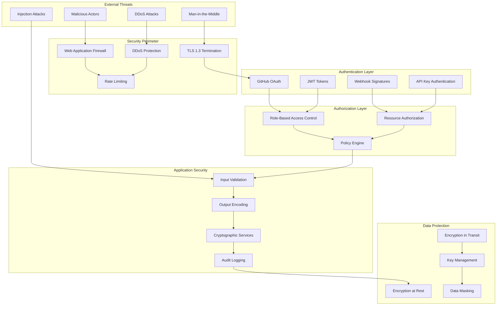
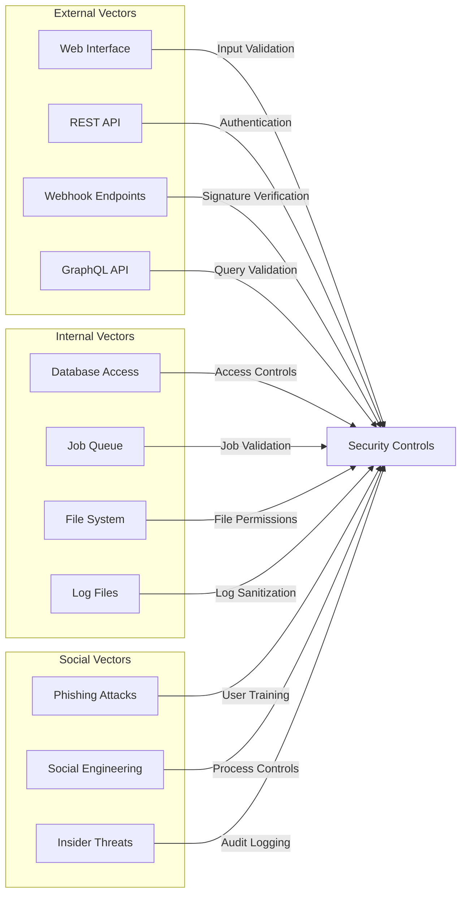
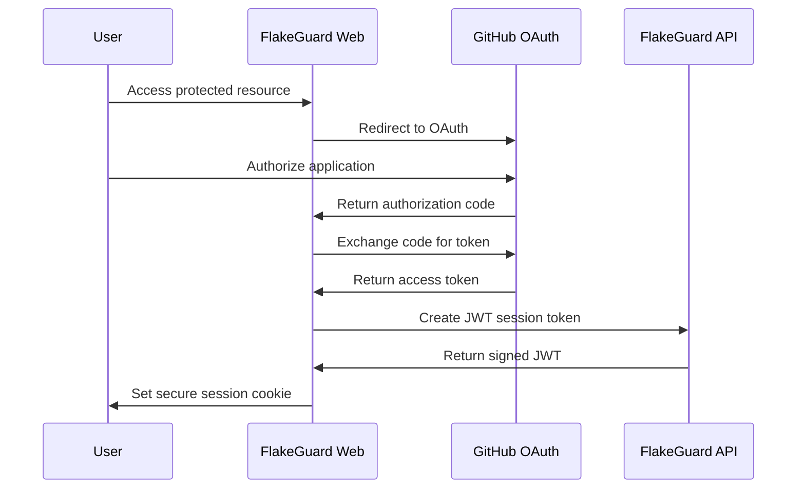
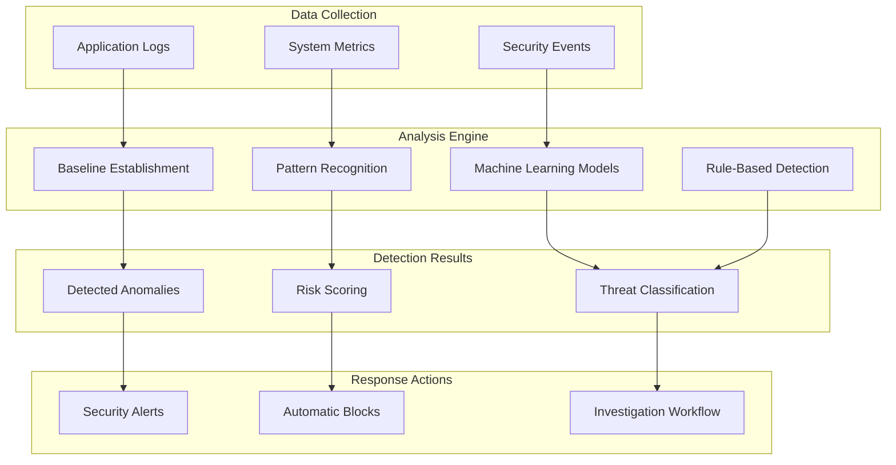

# Security Model

FlakeGuard implements a comprehensive security-first approach to protect sensitive test data, ensure authenticated access, and maintain the integrity of the flakiness detection system.

## Security Architecture



## Threat Model

### Threat Categories

#### 1. Data Breach Threats
- **Test Data Exposure**: Unauthorized access to test results and failure messages
- **Code Exposure**: Leakage of test names revealing business logic
- **Configuration Exposure**: Access to API keys, database connections, secrets
- **Historical Data Mining**: Unauthorized analysis of test patterns over time

#### 2. System Integrity Threats
- **Webhook Spoofing**: Malicious actors sending fake GitHub webhooks
- **Data Manipulation**: Tampering with flakiness scores or quarantine decisions
- **Report Falsification**: Generating misleading analysis reports
- **Configuration Tampering**: Unauthorized changes to system settings

#### 3. Availability Threats
- **DDoS Attacks**: Overwhelming the system with requests
- **Resource Exhaustion**: Consuming compute, memory, or storage resources
- **Service Dependencies**: Attacks on external services (GitHub, Slack)
- **Database Overload**: Expensive queries causing performance degradation

#### 4. Privacy Threats
- **User Tracking**: Unauthorized collection of user behavior data
- **Team Information Leakage**: Exposure of team structure and access patterns
- **Repository Metadata**: Unintended disclosure of private repository information
- **Cross-Tenant Data Access**: Users accessing other organizations' data

### Attack Vectors



## Authentication Mechanisms

### GitHub App Authentication

FlakeGuard uses GitHub Apps for secure, scoped access to repositories:

```typescript
// JWT Token Generation for GitHub API
const jwt = sign(
  {
    iat: Math.floor(Date.now() / 1000) - 60,
    exp: Math.floor(Date.now() / 1000) + (10 * 60),
    iss: process.env.GITHUB_APP_ID
  },
  privateKey,
  { algorithm: 'RS256' }
);

// Installation Token Exchange
const installationToken = await github.auth({
  type: 'installation',
  installationId: installation.id
});
```

**Security Features:**
- **Short-lived tokens**: JWT tokens expire in 10 minutes
- **Installation scoping**: Tokens are scoped to specific repository installations
- **Minimal permissions**: Only requested permissions are granted
- **Audit trail**: All GitHub API calls are logged with token metadata

### Webhook Signature Verification

All GitHub webhooks are cryptographically verified:

```typescript
function verifyWebhookSignature(
  payload: string,
  signature: string,
  secret: string
): boolean {
  const expectedSignature = 'sha256=' + 
    createHmac('sha256', secret)
      .update(payload, 'utf8')
      .digest('hex');
  
  return timingSafeEqual(
    Buffer.from(signature),
    Buffer.from(expectedSignature)
  );
}
```

**Security Properties:**
- **HMAC-SHA256**: Cryptographically secure signature algorithm
- **Timing-safe comparison**: Prevents timing attacks
- **Payload integrity**: Ensures webhook content hasn't been tampered with
- **Replay protection**: Combined with timestamp validation

### User Authentication

Web dashboard authentication via GitHub OAuth:



**Security Features:**
- **OAuth 2.0 PKCE**: Proof Key for Code Exchange for additional security
- **State parameter**: Prevents CSRF attacks during OAuth flow
- **Secure cookies**: HttpOnly, Secure, SameSite flags
- **JWT tokens**: Stateless authentication with signature verification

## Authorization Framework

### Role-Based Access Control (RBAC)

```typescript
enum Role {
  ADMIN = 'admin',           // Full system access
  MAINTAINER = 'maintainer', // Manage repositories
  DEVELOPER = 'developer',   // View reports, manage own tests
  VIEWER = 'viewer'          // Read-only access
}

enum Permission {
  READ_REPORTS = 'read:reports',
  WRITE_QUARANTINE = 'write:quarantine',
  MANAGE_REPOS = 'manage:repositories',
  ADMIN_SYSTEM = 'admin:system'
}

const rolePermissions: Record<Role, Permission[]> = {
  [Role.ADMIN]: [
    Permission.READ_REPORTS,
    Permission.WRITE_QUARANTINE,
    Permission.MANAGE_REPOS,
    Permission.ADMIN_SYSTEM
  ],
  [Role.MAINTAINER]: [
    Permission.READ_REPORTS,
    Permission.WRITE_QUARANTINE,
    Permission.MANAGE_REPOS
  ],
  [Role.DEVELOPER]: [
    Permission.READ_REPORTS,
    Permission.WRITE_QUARANTINE
  ],
  [Role.VIEWER]: [
    Permission.READ_REPORTS
  ]
};
```

### Resource-Level Authorization

Access control is enforced at the resource level:

```typescript
class AuthorizationPolicy {
  async canAccessRepository(
    user: User,
    repository: Repository
  ): Promise<boolean> {
    // Check GitHub repository access
    const hasGitHubAccess = await this.github.canAccessRepo(
      user.githubToken,
      repository.fullName
    );
    
    if (!hasGitHubAccess) return false;
    
    // Check FlakeGuard-specific permissions
    const userRole = await this.getUserRole(user.id, repository.id);
    return userRole !== null;
  }
  
  async canQuarantineTest(
    user: User,
    test: Test
  ): Promise<boolean> {
    const canAccess = await this.canAccessRepository(
      user,
      test.repository
    );
    
    if (!canAccess) return false;
    
    const userRole = await this.getUserRole(user.id, test.repository.id);
    return this.hasPermission(userRole, Permission.WRITE_QUARANTINE);
  }
}
```

## Data Protection

### Encryption at Rest

All sensitive data is encrypted when stored:

```typescript
class EncryptionService {
  private readonly algorithm = 'aes-256-gcm';
  private readonly keyDerivation = 'pbkdf2';
  
  async encrypt(plaintext: string, key: string): Promise<EncryptedData> {
    const salt = randomBytes(16);
    const derivedKey = pbkdf2Sync(key, salt, 100000, 32, 'sha256');
    const iv = randomBytes(12);
    
    const cipher = createCipher(this.algorithm, derivedKey, { iv });
    const ciphertext = Buffer.concat([
      cipher.update(plaintext, 'utf8'),
      cipher.final()
    ]);
    
    return {
      ciphertext: ciphertext.toString('base64'),
      iv: iv.toString('base64'),
      salt: salt.toString('base64'),
      authTag: cipher.getAuthTag().toString('base64')
    };
  }
}
```

**Protected Data Types:**
- **Test failure messages**: May contain sensitive error details
- **Environment variables**: Configuration and secrets in test output
- **Stack traces**: Potentially revealing implementation details
- **File paths**: May expose directory structure
- **User tokens**: GitHub access tokens and API keys

### Encryption in Transit

All communications use TLS 1.3 with strict security headers:

```typescript
const securityHeaders = {
  'Strict-Transport-Security': 'max-age=31536000; includeSubDomains',
  'X-Content-Type-Options': 'nosniff',
  'X-Frame-Options': 'DENY',
  'X-XSS-Protection': '1; mode=block',
  'Referrer-Policy': 'strict-origin-when-cross-origin',
  'Content-Security-Policy': [
    "default-src 'self'",
    "script-src 'self' 'unsafe-inline'",
    "style-src 'self' 'unsafe-inline'",
    "img-src 'self' data: https:",
    "connect-src 'self'",
    "font-src 'self'"
  ].join('; ')
};
```

### Data Sanitization

Input sanitization prevents injection attacks:

```typescript
class InputValidator {
  sanitizeTestName(input: string): string {
    return input
      .replace(/[<>]/g, '') // Remove angle brackets
      .replace(/javascript:/gi, '') // Remove javascript: schemes
      .replace(/on\w+=/gi, '') // Remove event handlers
      .trim()
      .substring(0, 255); // Limit length
  }
  
  sanitizeErrorMessage(message: string): string {
    // Remove potential secrets (API keys, tokens, passwords)
    return message
      .replace(/\b[A-Za-z0-9+\/]{40,}\b/g, '[REDACTED]') // Base64 tokens
      .replace(/\b[A-Fa-f0-9]{32,}\b/g, '[REDACTED]') // Hex tokens
      .replace(/password[=:]\s*\S+/gi, 'password=[REDACTED]')
      .replace(/token[=:]\s*\S+/gi, 'token=[REDACTED]')
      .replace(/key[=:]\s*\S+/gi, 'key=[REDACTED]');
  }
}
```

## Security Monitoring

### Audit Logging

Comprehensive audit trail for security events:

```typescript
interface AuditEvent {
  id: string;
  timestamp: Date;
  userId?: string;
  sessionId: string;
  action: string;
  resource: string;
  resourceId: string;
  sourceIp: string;
  userAgent: string;
  result: 'success' | 'failure' | 'error';
  details: Record<string, unknown>;
  riskScore: number;
}

const auditEvents = [
  'user.login',
  'user.logout',
  'repository.access',
  'test.quarantine',
  'webhook.received',
  'api.access',
  'admin.action',
  'security.violation'
];
```

### Anomaly Detection

Automated detection of suspicious activities:



**Detection Patterns:**
- **Unusual login patterns**: Multiple failed attempts, unusual locations
- **API abuse**: Excessive requests, unusual endpoints
- **Data access patterns**: Bulk downloads, unusual query patterns
- **System resource usage**: Memory/CPU spikes, unusual network traffic

### Incident Response

Automated security incident handling:

```typescript
class SecurityIncidentHandler {
  async handleSecurityEvent(event: SecurityEvent): Promise<void> {
    const riskScore = await this.calculateRiskScore(event);
    
    if (riskScore >= CRITICAL_THRESHOLD) {
      await Promise.all([
        this.notifySecurityTeam(event),
        this.blockSuspiciousSource(event),
        this.createIncidentTicket(event),
        this.preserveEvidence(event)
      ]);
    } else if (riskScore >= WARNING_THRESHOLD) {
      await Promise.all([
        this.logSecurityWarning(event),
        this.increaseMonitoring(event.sourceIp),
        this.notifyAdministrators(event)
      ]);
    }
    
    await this.auditLog.record(event);
  }
}
```

## Compliance and Standards

### Security Standards Compliance

FlakeGuard adheres to industry security standards:

- **OWASP Top 10**: Protection against common web vulnerabilities
- **NIST Cybersecurity Framework**: Risk management and security controls
- **SOC 2 Type II**: Security, availability, and confidentiality controls
- **ISO 27001**: Information security management system

### Privacy Regulations

Compliance with data protection regulations:

- **GDPR**: European data protection rights and controls
- **CCPA**: California consumer privacy rights
- **PIPEDA**: Canadian privacy protection

### Security Assessments

Regular security evaluations:

- **Penetration Testing**: Quarterly external security assessments
- **Vulnerability Scanning**: Continuous automated scanning
- **Code Security Review**: Static and dynamic analysis
- **Dependency Auditing**: Third-party security vulnerability tracking

## Security Best Practices

### Development Security

- **Secure by Default**: Security controls enabled by default
- **Least Privilege**: Minimal required permissions
- **Defense in Depth**: Multiple layers of security controls
- **Fail Securely**: Secure failure modes and error handling

### Operational Security

- **Regular Updates**: Timely security patch application
- **Configuration Management**: Secure configuration baselines
- **Access Review**: Regular access permission audits
- **Incident Preparation**: Security incident response procedures

### Deployment Security

- **Environment Separation**: Isolated development, staging, and production
- **Secret Management**: Centralized secret storage and rotation
- **Network Security**: Firewalls, VPCs, and network segmentation
- **Monitoring**: Comprehensive security monitoring and alerting

This security model ensures FlakeGuard maintains the highest standards of security while providing reliable flaky test detection capabilities.

## Related Documentation

- [Authentication Guide](./authentication.md)
- [Authorization Framework](./authorization.md)
- [Data Protection](./data-protection.md)
- [Security Best Practices](./best-practices.md)