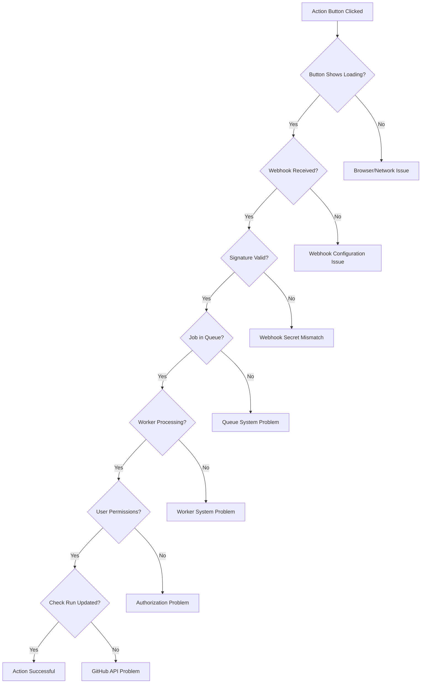

# Troubleshooting Common Issues

This guide covers the most frequently encountered issues with FlakeGuard and provides step-by-step solutions.

## Why Didn't My Requested Action Fire?

This is one of the most common questions from FlakeGuard users. Check runs show action buttons (like "Quarantine Test" or "Ignore Flake"), but clicking them doesn't seem to work.

### Quick Diagnostic Checklist



### Step 1: Verify Button Interaction

First, confirm the button click is registered:

1. **Open Browser Developer Tools** (F12)
2. **Go to Network tab**
3. **Click the action button** in the GitHub Check Run
4. **Look for network requests** to your FlakeGuard domain

**Expected behavior:**
- Button shows loading state (spinner or disabled appearance)
- Network request to `https://your-flakeguard-domain.com/api/github/webhook`
- Request includes `X-GitHub-Event: check_run` header

**Common issues:**
- **No network request**: JavaScript error or GitHub issue
- **Request to wrong domain**: Webhook URL misconfiguration
- **CORS errors**: Missing CORS configuration

### Step 2: Check Webhook Configuration

Verify your GitHub App webhook settings:

```bash
# Set your GitHub token (example)
export GITHUB_TOKEN='ghp_EXAMPLE_TOKEN_123456789abcdefghijklmnopqrstuvwxyz'

# Check current webhook configuration
curl -H "Authorization: $(printf '%s' "token $GITHUB_TOKEN")" \
     -H "Accept: application/vnd.github.v3+json" \
     https://api.github.com/app/hook/config
```

**Required webhook settings:**
- **URL**: `https://your-domain.com/api/github/webhook`
- **Content type**: `application/json`
- **Secret**: Must match `GITHUB_WEBHOOK_SECRET` environment variable
- **Events**: `check_run` must be enabled

**To update webhook settings:**
1. Go to your GitHub App settings
2. Navigate to "Webhook" section
3. Verify URL and secret
4. Ensure "Check runs" is checked in events

### Step 3: Verify Webhook Delivery

Check if FlakeGuard receives the webhook:

```bash
# Check recent webhook logs
docker logs flakeguard-api | grep "check_run" | tail -20

# Look for these patterns:
# ✅ "Received webhook: check_run"
# ✅ "Processing requested action: quarantine_test"
# ❌ "Invalid webhook signature"
# ❌ "Webhook validation failed"
```

**If no webhook logs appear:**
1. **Verify webhook URL** is accessible from the internet
2. **Check firewall rules** and load balancer configuration
3. **Test webhook URL** manually:

```bash
# Test webhook endpoint accessibility
curl -X POST https://your-domain.com/api/github/webhook \
  -H "Content-Type: application/json" \
  -H "X-GitHub-Event: ping" \
  -d '{"zen": "test"}'

# Expected: 400 Bad Request (missing signature)
# NOT expected: Connection refused, timeout, 502/503
```

### Step 4: Validate Webhook Signature

Webhook signature validation is the most common failure point:

```bash
# Check for signature validation errors
docker logs flakeguard-api | grep -i "signature\|hmac" | tail -10

# Common error messages:
# "Invalid webhook signature"
# "Missing X-Hub-Signature-256 header"  
# "HMAC verification failed"
```

**To fix signature issues:**

1. **Verify webhook secret** in GitHub App settings matches environment variable:
   ```bash
   # Check current secret (first 10 characters)
   echo $GITHUB_WEBHOOK_SECRET | head -c 10
   ```

2. **Generate new webhook secret** if needed:
   ```bash
   # Generate new secret
   NEW_SECRET=$(openssl rand -base64 32)
   echo "New webhook secret: $NEW_SECRET"
   
   # Update GitHub App webhook secret
   # Update GITHUB_WEBHOOK_SECRET environment variable
   # Restart FlakeGuard services
   ```

3. **Test signature validation**:
   ```bash
   # Test with sample payload
   PAYLOAD='{"action":"requested","check_run":{"id":123}}'
   SIGNATURE=$(echo -n "$PAYLOAD" | openssl dgst -sha256 -hmac "$GITHUB_WEBHOOK_SECRET" -binary | base64)
   
   curl -X POST https://your-domain.com/api/github/webhook \
     -H "Content-Type: application/json" \
     -H "X-GitHub-Event: check_run" \
     -H "X-Hub-Signature-256: sha256=$SIGNATURE" \
     -d "$PAYLOAD"
   ```

### Step 5: Check Job Queue Processing

Verify the action is queued for processing:

```bash
# Check Redis queue for pending jobs
redis-cli -h localhost -p 6379 LLEN "bull:flakeguard:waiting"

# Check for specific job types
redis-cli -h localhost -p 6379 KEYS "bull:flakeguard:*"

# Check job details
redis-cli -h localhost -p 6379 LRANGE "bull:flakeguard:waiting" 0 -1
```

**Expected queue jobs for requested actions:**
- `QuarantineTestJob`
- `IgnoreFlakeJob`
- `ReanalysisJob`

**If no jobs in queue:**
- Webhook processing failed before queuing
- Check API server logs for errors
- Verify webhook payload parsing

### Step 6: Monitor Worker Processing

Check if workers are processing the queued jobs:

```bash
# Check worker logs
docker logs flakeguard-worker | grep -i "processing\|completed\|failed" | tail -20

# Look for patterns:
# ✅ "Processing job: QuarantineTestJob"
# ✅ "Job completed successfully" 
# ❌ "Job failed with error"
# ❌ "Worker connection lost"
```

**Common worker issues:**

1. **Worker not running**:
   ```bash
   # Check worker status
   docker ps | grep worker
   
   # Restart if needed
   docker-compose restart worker
   ```

2. **Database connection issues**:
   ```bash
   # Check database connectivity from worker
   docker exec flakeguard-worker node -e "
     const { PrismaClient } = require('@prisma/client');
     const prisma = new PrismaClient();
     prisma.\$connect().then(() => console.log('DB OK')).catch(console.error);
   "
   ```

3. **GitHub API token issues**:
   ```bash
   # Test GitHub API access
   docker exec flakeguard-worker node -e "
     const { Octokit } = require('@octokit/rest');
     const octokit = new Octokit({ auth: process.env.GITHUB_APP_PRIVATE_KEY });
     octokit.rest.apps.getAuthenticated().then(console.log).catch(console.error);
   "
   ```

### Step 7: Verify User Permissions

Check if the user has permission to perform the requested action:

```bash
# Check user permissions in database
docker exec flakeguard-api node -e "
  const { PrismaClient } = require('@prisma/client');
  const prisma = new PrismaClient();
  
  // Replace with actual user and repo IDs
  prisma.userRepository.findFirst({
    where: {
      userId: 'USER_ID',
      repositoryId: 'REPO_ID'
    },
    include: { role: true }
  }).then(console.log).catch(console.error);
"
```

**Required permissions for actions:**
- **Quarantine Test**: `write:quarantine` permission
- **Ignore Flake**: `write:quarantine` permission  
- **Reanalyze**: `read:reports` permission

### Step 8: Check GitHub API Updates

Verify that FlakeGuard can update the Check Run:

```bash
# Check for GitHub API errors in worker logs
docker logs flakeguard-worker | grep -i "github\|check.*run\|api.*error" | tail -20

# Common issues:
# "GitHub API rate limit exceeded"
# "Installation token expired"
# "Insufficient permissions for check runs"
```

**To test GitHub API access:**

```bash
# Set your installation token (example)
export INSTALLATION_TOKEN='ghs_EXAMPLE_INSTALLATION_TOKEN_123456789abcdef'

# Test Check Run update manually
curl -X PATCH \
  -H "Authorization: $(printf '%s' "token $INSTALLATION_TOKEN")" \
  -H "Accept: application/vnd.github.v3+json" \
  https://api.github.com/repos/OWNER/REPO/check-runs/CHECK_RUN_ID \
  -d '{"status":"completed","conclusion":"success","output":{"title":"Test Update","summary":"Manual test"}}'
```

## Complete Diagnostic Script

Use this comprehensive script to diagnose requested action issues:

```bash
#!/bin/bash

echo "🔍 FlakeGuard Requested Action Diagnostic"
echo "========================================="

# Configuration
FLAKEGUARD_DOMAIN="your-domain.com"
GITHUB_REPO="owner/repo"
CHECK_RUN_ID="123456789"

echo ""
echo "1. 🌐 Testing webhook endpoint accessibility..."
WEBHOOK_STATUS=$(curl -s -o /dev/null -w "%{http_code}" -X POST \
  "https://$FLAKEGUARD_DOMAIN/api/github/webhook" \
  -H "Content-Type: application/json" \
  -H "X-GitHub-Event: ping" \
  -d '{"zen":"test"}')

if [ "$WEBHOOK_STATUS" = "400" ]; then
    echo "   ✅ Webhook endpoint is accessible"
elif [ "$WEBHOOK_STATUS" = "000" ]; then
    echo "   ❌ Webhook endpoint is not accessible (connection failed)"
    echo "   🔧 Check DNS, firewall, and load balancer configuration"
else
    echo "   ⚠️  Webhook endpoint returned unexpected status: $WEBHOOK_STATUS"
fi

echo ""
echo "2. 📋 Checking recent webhook logs..."
WEBHOOK_LOGS=$(docker logs flakeguard-api --tail 50 | grep -c "check_run")
echo "   Found $WEBHOOK_LOGS check_run webhook entries in recent logs"

if [ "$WEBHOOK_LOGS" -eq 0 ]; then
    echo "   ❌ No check_run webhooks received recently"
    echo "   🔧 Verify GitHub App webhook configuration"
else
    echo "   ✅ Webhooks are being received"
fi

echo ""
echo "3. 🔐 Checking signature validation..."
SIG_ERRORS=$(docker logs flakeguard-api --tail 100 | grep -c -i "signature\|hmac")
if [ "$SIG_ERRORS" -gt 0 ]; then
    echo "   ❌ Found $SIG_ERRORS signature validation errors"
    echo "   🔧 Verify GITHUB_WEBHOOK_SECRET matches GitHub App settings"
else
    echo "   ✅ No signature validation errors found"
fi

echo ""
echo "4. 📤 Checking job queue status..."
QUEUE_LENGTH=$(redis-cli -h localhost -p 6379 LLEN "bull:flakeguard:waiting" 2>/dev/null || echo "N/A")
if [ "$QUEUE_LENGTH" != "N/A" ]; then
    echo "   Current queue length: $QUEUE_LENGTH jobs"
    if [ "$QUEUE_LENGTH" -gt 0 ]; then
        echo "   ⚠️  Jobs are queued but not processing"
        echo "   🔧 Check worker service status"
    else
        echo "   ✅ Queue is empty (jobs processing normally)"
    fi
else
    echo "   ❌ Cannot connect to Redis"
    echo "   🔧 Check Redis service status"
fi

echo ""
echo "5. ⚙️  Checking worker service..."
WORKER_STATUS=$(docker ps --filter "name=worker" --format "{{.Status}}" 2>/dev/null)
if [[ $WORKER_STATUS == *"Up"* ]]; then
    echo "   ✅ Worker service is running"
    
    WORKER_ERRORS=$(docker logs flakeguard-worker --tail 50 | grep -c -i "error\|failed")
    if [ "$WORKER_ERRORS" -gt 0 ]; then
        echo "   ⚠️  Found $WORKER_ERRORS recent worker errors"
        echo "   🔧 Check worker logs: docker logs flakeguard-worker"
    else
        echo "   ✅ No recent worker errors"
    fi
else
    echo "   ❌ Worker service is not running"
    echo "   🔧 Start worker: docker-compose up -d worker"
fi

echo ""
echo "6. 🔑 Testing GitHub API access..."
if docker exec flakeguard-worker node -e "
  const { Octokit } = require('@octokit/rest');
  const { createAppAuth } = require('@octokit/auth-app');
  
  const auth = createAppAuth({
    appId: process.env.GITHUB_APP_ID,
    privateKey: process.env.GITHUB_APP_PRIVATE_KEY,
  });
  
  auth({ type: 'app' }).then(() => {
    console.log('GitHub API authentication successful');
    process.exit(0);
  }).catch((error) => {
    console.error('GitHub API authentication failed:', error.message);
    process.exit(1);
  });
" &>/dev/null; then
    echo "   ✅ GitHub API authentication working"
else
    echo "   ❌ GitHub API authentication failed"
    echo "   🔧 Check GITHUB_APP_ID and GITHUB_APP_PRIVATE_KEY"
fi

echo ""
echo "📊 Diagnostic Summary"
echo "===================="
echo "If all checks show ✅, the issue may be:"
echo "• User permissions (check database user roles)"
echo "• Specific GitHub App installation permissions"
echo "• Rate limiting (check GitHub API rate limits)"
echo "• Temporary GitHub service issues"
echo ""
echo "For further debugging:"
echo "• Check detailed logs: docker logs flakeguard-api --tail 100"
echo "• Monitor webhook delivery: GitHub App > Advanced > Recent Deliveries"
echo "• Test manually: Use GitHub API to trigger check_run events"
```

## Quick Fix Commands

### Restart All Services
```bash
# Full restart
docker-compose down && docker-compose up -d

# Restart specific services
docker-compose restart api worker
```

### Clear Job Queue
```bash
# Clear stuck jobs
redis-cli -h localhost -p 6379 FLUSHDB

# Restart worker to reload jobs
docker-compose restart worker
```

### Reset Webhook Configuration
```bash
# Generate new webhook secret
NEW_SECRET=$(openssl rand -base64 32)

# Update environment variable
echo "GITHUB_WEBHOOK_SECRET=$NEW_SECRET" >> apps/api/.env

# Update GitHub App webhook secret in GitHub settings
# Restart services
docker-compose restart api worker
```

### Test Action Manually
```bash
# Set your API token (example)
export API_TOKEN='fg_EXAMPLE_TOKEN_1234567890abcdef'

# Trigger quarantine action via API
curl -X POST https://your-domain.com/api/actions/quarantine \
  -H "Authorization: $(printf '%s' "Bearer $API_TOKEN")" \
  -H "Content-Type: application/json" \
  -d '{
    "testId": "test-identifier", 
    "repositoryId": "repo-id",
    "reason": "manual_quarantine"
  }'
```

## Getting Help

If you're still experiencing issues after following this guide:

1. **Enable Debug Logging**:
   ```bash
   # Set LOG_LEVEL=debug in environment
   echo "LOG_LEVEL=debug" >> apps/api/.env
   docker-compose restart api worker
   ```

2. **Collect Diagnostic Information**:
   - Recent logs from API and worker services
   - GitHub webhook delivery logs
   - Redis queue status
   - Database connection status

3. **Create GitHub Issue**:
   - Include diagnostic output
   - Provide sanitized configuration
   - Describe expected vs actual behavior
   - Include timeline of issue occurrence

4. **Community Support**:
   - [GitHub Discussions](https://github.com/flakeguard/flakeguard/discussions)
   - [Stack Overflow](https://stackoverflow.com/questions/tagged/flakeguard)

Remember: Most requested action issues are configuration-related and can be resolved by carefully checking webhook settings, environment variables, and service connectivity.

## Related Documentation

- [Webhook Processing](../concepts/webhook-processing.md)
- [GitHub App Setup](../getting-started/github-app-setup.md)
- [Debugging Guide](./debugging-guide.md)
- [Performance Issues](./performance-issues.md)