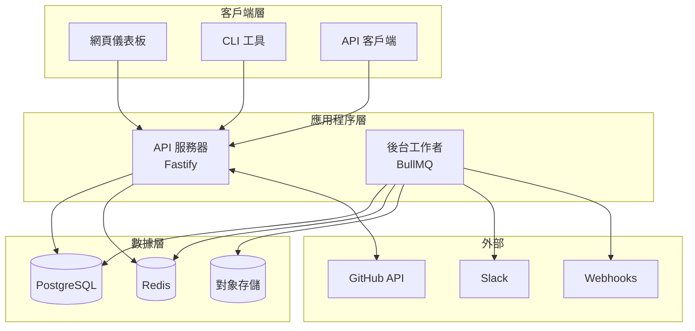

# 歡迎使用 FlakeGuard

**讓你的測試更可靠，一次解決一個不穩定測試。**

FlakeGuard 是一個生產級系統，用於檢測、監控和管理 CI/CD 流水線中的不穩定測試。它與 GitHub Actions 無縫集成，自動分析測試結果，識別不可靠的測試，並提供可執行的建議來改善測試套件的可靠性。

## 為什麼選擇 FlakeGuard？

不穩定測試是開發團隊的主要生產力殺手：
- **開發者浪費時間** 重新運行失敗的構建
- **CI/CD 流水線變得不可靠** 結果不一致
- **團隊失去信心** 對測試套件的信任
- **重要錯誤被掩蓋** 被不穩定測試的噪音覆蓋
- **部署速度下降** 由於不可靠的信號

FlakeGuard 通過智能自動化和深度洞察解決這些問題。

## 核心功能

### 🔍 **自動不穩定檢測**
先進算法分析多次運行中的測試執行模式，以高信心度識別不穩定測試。

### 📊 **智能評分**
精密的不穩定性評分系統為每個測試提供信心水平和可執行建議。

### 🔗 **GitHub 集成** 
通過 GitHub App 與 GitHub Actions 無縫集成。無需更改工作流程。

### 📈 **實時分析**
通過全面的儀表板和報告追踪測試可靠性趨勢。

### 🛡️ **隔離管理**
基於可配置的不穩定性策略自動建議測試隔離。

### 🚀 **生產就緒**
使用 TypeScript、現代 Node.js 以及企業級安全和監控構建。

## 工作原理


1. **你的測試運行** 在 GitHub Actions 中並生成 JUnit XML 報告
2. **FlakeGuard 接收 webhooks** 當工作流完成時
3. **測試結果被分析** 使用統計算法
4. **計算不穩定性分數** 並提供信心水平
5. **生成詳細報告** 包含可執行建議
6. **結果自動顯示** 作為提交和拉取請求上的檢查運行

## 快速開始

在 10 分鐘內讓 FlakeGuard 運行：

### 1. 使用 Docker Compose 開始

```bash
git clone https://github.com/flakeguard/flakeguard.git
cd flakeguard
cp .env.example .env
docker-compose up -d
pnpm install && pnpm migrate:dev && pnpm dev
```

### 2. 創建 GitHub App

[設置 GitHub App](./getting-started/github-app-setup.md) 將 FlakeGuard 與你的存儲庫連接。

### 3. 添加到你的工作流

無需更改！FlakeGuard 自動處理現有工作流的測試產物。

### 4. 查看結果

檢查運行自動出現在提交上，包含詳細的不穩定性分析和建議。

[**→ 立即開始**](./getting-started/quick-start.md)

## 架構概覽

FlakeGuard 使用現代微服務架構，專為可擴展性和可靠性而設計：



**核心組件：**
- **API 服務器** - 基於 Fastify 的 REST API 處理 webhooks 和請求
- **後台工作者** - 由 BullMQ 驅動的作業處理器用於分析任務
- **PostgreSQL** - 測試結果和分析數據的主數據庫
- **Redis** - 作業隊列和高性能緩存層
- **網頁儀表板** - 基於 Next.js 的 UI，用於分析和管理

[**→ 了解更多架構信息**](./architecture/overview.md)

## 文檔部分

### 🚀 入門指南
適合想要快速運行 FlakeGuard 的新用戶。
- [介紹](./getting-started/introduction.md) - 什麼是 FlakeGuard？
- [快速開始](./getting-started/quick-start.md) - 10 分鐘內啟動運行
- [安裝](./getting-started/installation.md) - 生產部署
- [GitHub App 設置](./getting-started/github-app-setup.md) - 連接到你的存儲庫

### 💡 核心概念  
了解 FlakeGuard 的底層工作原理。
- [不穩定測試](./concepts/flaky-tests.md) - 什麼讓測試不穩定？
- [評分算法](./concepts/scoring-algorithm.md) - 如何計算不穩定性
- [隔離系統](./concepts/quarantine-system.md) - 管理不可靠的測試

### 🔧 配置和部署
為你的環境設置 FlakeGuard。
- [環境變量](./configuration/environment-variables.md) - 配置選項
- [Docker 部署](./deployment/docker.md) - 容器部署
- [Kubernetes](./deployment/kubernetes.md) - 編排部署

### 🔒 安全與合規
企業級安全和合規信息。
- [安全模型](./security/security-model.md) - 威脅模型和保護
- [身份驗證](./security/authentication.md) - 用戶和服務身份驗證
- [數據保護](./security/data-protection.md) - 隱私和加密

### 📊 監控與運維  
在生產環境中保持 FlakeGuard 平穩運行。
- [SLO 和 DORA 指標](./monitoring/slos-dora.md) - 服務目標和 DevOps 指標
- [健康檢查](./monitoring/health-checks.md) - 系統監控
- [性能調優](./monitoring/performance.md) - 優化指南

### 🔌 API 參考
集成的完整 API 文檔。
- [REST API](./api/introduction.md) - 完整的 REST API 參考
- [GraphQL API](./api/graphql/overview.md) - GraphQL 模式和查詢
- [SDK](./api/sdks/javascript.md) - 官方客戶端庫

### 🆘 故障排除
解決常見問題。
- [常見問題](./troubleshooting/common-issues.md) - FAQ 和快速修復
- [調試指南](./troubleshooting/debugging-guide.md) - 高級故障排除
- [性能問題](./troubleshooting/performance-issues.md) - 性能調試

## 使用場景

### 持續集成
- **減少 CI/CD 噪音** 來自不穩定測試失敗
- **提高部署信心** 通過可靠的測試信號
- **加速開發速度** 通過消除虛假失敗

### 質量保證
- **跟踪測試套件健康** 隨時間變化的全面指標
- **識別問題測試** 在它們影響團隊之前
- **優先改進測試** 基於不穩定性影響

### DevOps 和平台工程
- **監控系統可靠性** 通過測試穩定性指標
- **與現有工具鏈集成** 通過 API 和 webhooks
- **擴展測試基礎設施** 充滿信心

### 企業合規
- **審計測試可靠性** 滿足合規要求
- **跟踪改進指標** 用於工程 KPI
- **生成報告** 為利益相關者和領導層

## 社區與支持

### 🤝 社區
- [GitHub 討論](https://github.com/flakeguard/flakeguard/discussions) - 社區問答
- [Stack Overflow](https://stackoverflow.com/questions/tagged/flakeguard) - 技術問題
- [Discord 服務器](https://discord.gg/flakeguard) - 實時聊天

### 📝 貢獻  
- [貢獻指南](./development/contributing.md) - 如何貢獻
- [開發設置](./development/local-setup.md) - 本地開發
- [架構決策](./development/architecture-decisions.md) - 設計決策

### 🆘 支持
- [GitHub Issues](https://github.com/flakeguard/flakeguard/issues) - 錯誤報告和功能請求
- [安全問題](https://github.com/flakeguard/flakeguard/security) - 安全漏洞
- [企業支持](mailto:enterprise@flakeguard.dev) - 商業支持

## 下一步？

準備從你的 CI/CD 流水線中消除不穩定測試？以下是最佳的下一步驟：

1. **📖 初次使用 FlakeGuard？** 從我們的 [介紹](./getting-started/introduction.md) 開始
2. **🚀 想要試用？** 按照 [快速開始指南](./getting-started/quick-start.md) 操作
3. **🏢 計劃生產部署？** 查看 [安裝選項](./getting-started/installation.md)
4. **🔌 構建集成？** 探索 [API 文檔](./api/introduction.md)
5. **🎯 企業功能？** 了解 [安全與合規](./security/security-model.md)

---

**FlakeGuard** - 讓你的測試更可靠，一次解決一個不穩定測試。

*由理解不穩定測試痛苦的開發者用 ❤️ 構建。*