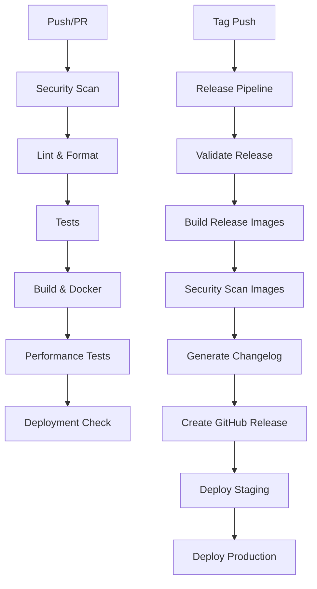

# CI/CD Pipeline Documentation

## Overview

FlakeGuard implements a comprehensive CI/CD pipeline built on GitHub Actions with modern deployment practices including semantic versioning, automated security scanning, multi-architecture Docker images, and blue-green deployments.

## Table of Contents

1. [Pipeline Architecture](#pipeline-architecture)
2. [Workflows](#workflows)
3. [Docker Images](#docker-images)
4. [Deployment Strategy](#deployment-strategy)
5. [Security & Compliance](#security--compliance)
6. [Monitoring & Observability](#monitoring--observability)
7. [Environment Configuration](#environment-configuration)
8. [Release Process](#release-process)
9. [Troubleshooting](#troubleshooting)

## Pipeline Architecture

### High-Level Flow



### Core Principles

- **Security First**: Every component scanned for vulnerabilities
- **Zero Downtime**: Blue-green deployments with health checks
- **Multi-Architecture**: Support for AMD64 and ARM64 platforms
- **Quality Gates**: Comprehensive testing before production
- **Observability**: Full monitoring and alerting integration
- **Compliance**: SBOM generation and license checking

## Workflows

### 1. CI Workflow (`.github/workflows/ci.yml`)

**Trigger**: Push to main, Pull Requests

**Jobs**:
- **Security Scan**: TruffleHog, license checker, audit
- **Lint & Format**: ESLint, Prettier, TypeScript checks
- **Test**: Unit, integration, and E2E tests with matrix builds
- **Build**: Docker images with multi-architecture support
- **Performance Tests**: Benchmarking and load testing
- **Deployment Check**: Readiness validation

```yaml
# Example job configuration
test:
  name: Test (Node ${{ matrix.node-version }})
  strategy:
    matrix:
      node-version: ['18', '20', '21']
  services:
    postgres:
      image: postgres:16-alpine
    redis:
      image: redis:7-alpine
```

### 2. Release Workflow (`.github/workflows/release.yml`)

**Trigger**: Version tags (`v*.*.*`), Manual dispatch

**Jobs**:
- **Validate Release**: Version format and tag validation
- **Pre-Release Tests**: Full CI pipeline execution
- **Build Release Images**: Production-ready containers
- **Security Scan Images**: Trivy and Grype scanning
- **Generate Changelog**: Automated from conventional commits
- **Create GitHub Release**: With artifacts and release notes
- **Deploy Staging**: Kubernetes deployment with smoke tests
- **Deploy Production**: Blue-green deployment strategy

### 3. Security Workflow (`.github/workflows/security.yml`)

**Trigger**: Schedule (daily), Dependency changes

**Jobs**:
- **CodeQL Analysis**: Static code security analysis
- **Dependency Scan**: NPM audit, Snyk, OSV Scanner
- **License Check**: Compliance validation
- **Docker Security**: Container vulnerability scanning
- **Secret Scan**: TruffleHog and GitLeaks
- **SBOM Generation**: Software Bill of Materials
- **Dependency Updates**: Automated PR creation

## Docker Images

### Multi-Stage Build Strategy

Each application uses optimized multi-stage Dockerfiles:

1. **Dependencies Stage**: Install and cache dependencies
2. **Shared Package Build**: Build common packages
3. **Application Build**: Compile application code
4. **Security Scanning**: Optional vulnerability checks
5. **Runtime Stage**: Minimal production image

### Image Security Features

- **Non-root users**: All containers run as unprivileged users
- **Minimal base images**: Alpine Linux with security updates
- **Distroless runtime**: Reduced attack surface
- **Multi-architecture**: AMD64 and ARM64 support
- **SBOM included**: Software Bill of Materials
- **Signature verification**: Signed container images

### Image Tags

```bash
# Semantic versioning
ghcr.io/flakeguard/flakeguard-api:1.2.3
ghcr.io/flakeguard/flakeguard-api:1.2
ghcr.io/flakeguard/flakeguard-api:1

# Branch-based
ghcr.io/flakeguard/flakeguard-api:main-abc1234

# Latest (production releases only)
ghcr.io/flakeguard/flakeguard-api:latest
```

### Building Locally

```bash
# Build specific application
docker build -f apps/api/Dockerfile -t flakeguard-api .

# Multi-platform build
docker buildx build --platform linux/amd64,linux/arm64 -f apps/api/Dockerfile .

# Build with cache
docker build --cache-from type=gha --cache-to type=gha,mode=max .
```

## Deployment Strategy

### Environments

1. **Development**: Local Docker Compose
2. **Staging**: Kubernetes cluster with production-like configuration
3. **Production**: High-availability Kubernetes with blue-green deployments

### Blue-Green Deployment Process

1. **Deploy New Version**: Create new deployment with version suffix
2. **Health Checks**: Validate new version is healthy
3. **Traffic Switch**: Update service selectors
4. **Validation**: Run production smoke tests
5. **Cleanup**: Remove old deployments (keep last 3)

```bash
# Example production deployment
kubectl apply -f k8s/production/
kubectl rollout status deployment/flakeguard-api-v1.2.3
kubectl patch service flakeguard-api-service \
  --type='merge' \
  -p='{"spec":{"selector":{"version":"1.2.3"}}}'
```

### Rollback Strategy

```bash
# Quick rollback to previous version
kubectl rollout undo deployment/flakeguard-api

# Rollback to specific version
kubectl rollout undo deployment/flakeguard-api --to-revision=2

# Emergency traffic switch
kubectl patch service flakeguard-api-service \
  --type='merge' \
  -p='{"spec":{"selector":{"version":"1.2.2"}}}'
```

## Security & Compliance

### Security Scanning Pipeline

1. **Static Analysis**: CodeQL for code security issues
2. **Dependency Scanning**: Multiple tools (Snyk, OSV, npm audit)
3. **Container Scanning**: Trivy and Grype for vulnerabilities
4. **Secret Detection**: TruffleHog and GitLeaks
5. **License Compliance**: Automated license checking

### Compliance Features

- **SBOM Generation**: SPDX and CycloneDX formats
- **Vulnerability Database**: Integration with CVE feeds
- **Security Alerts**: Automated security notifications
- **Audit Logs**: Complete deployment audit trail

### Security Policies

```yaml
# Example security policy
security:
  vulnerability_threshold: HIGH
  license_allowlist:
    - MIT
    - Apache-2.0
    - BSD-3-Clause
  secret_patterns:
    - api_key
    - password
    - private_key
```

## Monitoring & Observability

### Metrics Collection

- **Application Metrics**: Prometheus/OpenTelemetry
- **Infrastructure Metrics**: Node exporter, cAdvisor
- **Business Metrics**: Custom application metrics
- **Security Metrics**: Vulnerability counts, scan results

### Alerting Rules

```yaml
# Example alert rule
groups:
  - name: flakeguard.rules
    rules:
      - alert: HighErrorRate
        expr: rate(http_requests_total{status=~"5.."}[5m]) > 0.1
        for: 5m
        labels:
          severity: critical
        annotations:
          summary: High error rate detected
```

### Dashboards

Pre-configured Grafana dashboards for:
- Application performance
- Infrastructure health
- Deployment metrics
- Security posture
- Business KPIs

## Environment Configuration

### Environment Variables

```env
# Core Application
NODE_ENV=production
LOG_LEVEL=info
PORT=3000
VERSION=1.2.3

# Database
DATABASE_URL=postgresql://...
DATABASE_POOL_MIN=5
DATABASE_POOL_MAX=20

# Redis
REDIS_URL=redis://...
REDIS_KEY_PREFIX=flakeguard:prod

# Security
JWT_SECRET_FILE=/run/secrets/jwt_secret
API_KEY_FILE=/run/secrets/api_key

# GitHub Integration
GITHUB_APP_ID=123456
GITHUB_APP_PRIVATE_KEY_FILE=/run/secrets/github_key

# Monitoring
PROMETHEUS_ENABLED=true
SENTRY_DSN=https://...
```

### Secrets Management

**Development**: `.env` files (not committed)
**Production**: Docker secrets or Kubernetes secrets

```bash
# Create Docker secret
echo "secret-value" | docker secret create jwt_secret -

# Create Kubernetes secret
kubectl create secret generic flakeguard-secrets \
  --from-literal=jwt-secret="secret-value"
```

## Release Process

### Semantic Versioning

FlakeGuard follows [Semantic Versioning](https://semver.org/):

- **MAJOR**: Breaking API changes
- **MINOR**: New features, backwards compatible
- **PATCH**: Bug fixes, backwards compatible

### Conventional Commits

Use [Conventional Commits](https://www.conventionalcommits.org/) for automatic changelog generation:

```bash
feat: add GitHub webhook endpoint for check runs
fix: resolve flaky test detection algorithm edge case
docs: update README with deployment instructions
perf: optimize JUnit report parsing performance
```

### Release Workflow

1. **Create Release Tag**: `git tag v1.2.3`
2. **Push Tag**: `git push origin v1.2.3`
3. **Automated Pipeline**: Builds, tests, and deploys
4. **Manual Verification**: Staging environment validation
5. **Production Deployment**: Automatic for non-pre-release versions

### Manual Release

```bash
# Trigger manual release
gh workflow run release.yml \
  --field version=1.2.3 \
  --field pre_release=false \
  --field skip_deploy=false
```

## Troubleshooting

### Common Issues

#### Build Failures

```bash
# Check build logs
gh run list --workflow=ci.yml --limit=1
gh run view <run-id> --log

# Debug locally
docker build -f apps/api/Dockerfile --progress=plain .
```

#### Deployment Issues

```bash
# Check deployment status
kubectl get deployments -n production
kubectl describe deployment flakeguard-api -n production

# View logs
kubectl logs -f deployment/flakeguard-api -n production
```

#### Security Scan Failures

```bash
# Run security scan locally
trivy fs --security-checks vuln,secret .
snyk test --all-projects
```

### Performance Issues

```bash
# Monitor resource usage
kubectl top pods -n production
kubectl top nodes

# Scale deployments
kubectl scale deployment flakeguard-api --replicas=5 -n production
```

### Debugging Tips

1. **Enable Debug Logging**: Set `LOG_LEVEL=debug`
2. **Check Health Endpoints**: `/health`, `/metrics`
3. **Monitor Resource Usage**: CPU, memory, disk
4. **Review Recent Changes**: Git history and deployment logs
5. **Check Dependencies**: Database, Redis, external APIs

### Emergency Procedures

#### Quick Rollback

```bash
# Rollback to previous version
kubectl rollout undo deployment/flakeguard-api -n production

# Switch traffic immediately
kubectl patch service flakeguard-api-service -n production \
  --type='merge' \
  -p='{"spec":{"selector":{"version":"previous"}}}'
```

#### Scale Down/Up

```bash
# Emergency scale down
kubectl scale deployment flakeguard-api --replicas=0 -n production

# Scale back up
kubectl scale deployment flakeguard-api --replicas=3 -n production
```

#### Enable Maintenance Mode

```bash
# Update load balancer configuration
kubectl apply -f k8s/maintenance-mode.yaml
```

## Best Practices

### Development

1. **Use Feature Branches**: `feat/area-description`
2. **Write Tests**: Unit, integration, and E2E coverage
3. **Follow Conventional Commits**: For automatic changelog
4. **Security First**: Regular dependency updates
5. **Monitor Performance**: Benchmark critical paths

### Operations

1. **Blue-Green Deployments**: Zero-downtime releases
2. **Health Checks**: Comprehensive service validation
3. **Monitoring**: Proactive alerting and dashboards
4. **Backup Strategy**: Regular data and configuration backups
5. **Disaster Recovery**: Tested recovery procedures

### Security

1. **Regular Scans**: Automated vulnerability detection
2. **Secrets Rotation**: Regular credential updates
3. **Least Privilege**: Minimal permissions required
4. **Audit Trails**: Complete deployment logging
5. **Compliance**: SBOM and license management

---

For additional support, consult the [FlakeGuard documentation](https://github.com/flakeguard/flakeguard/wiki) or contact the development team.