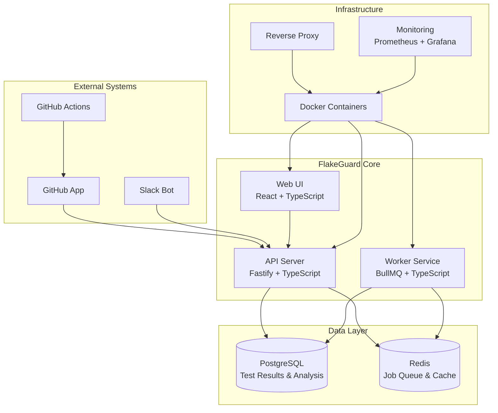
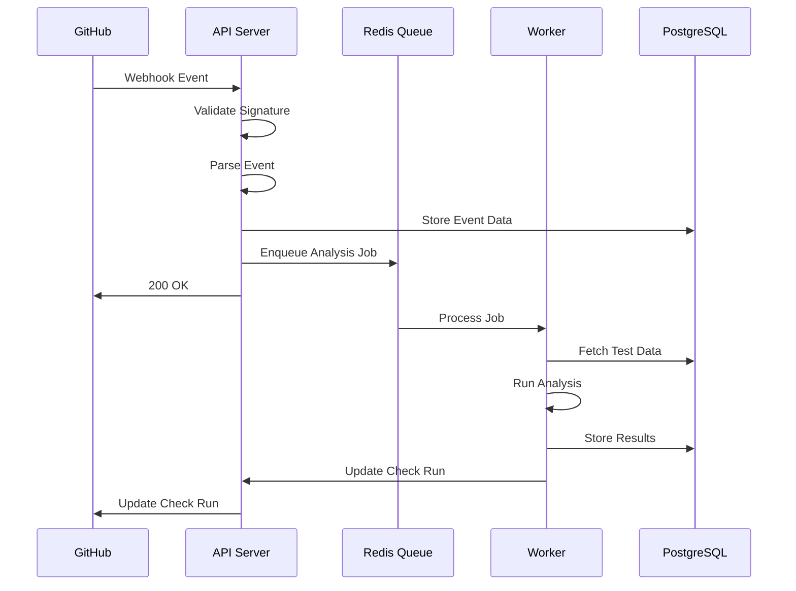
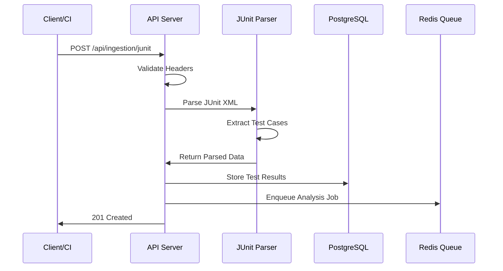
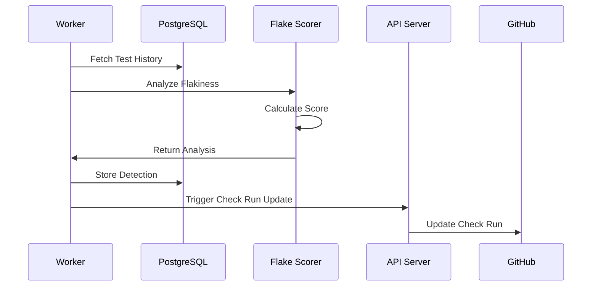
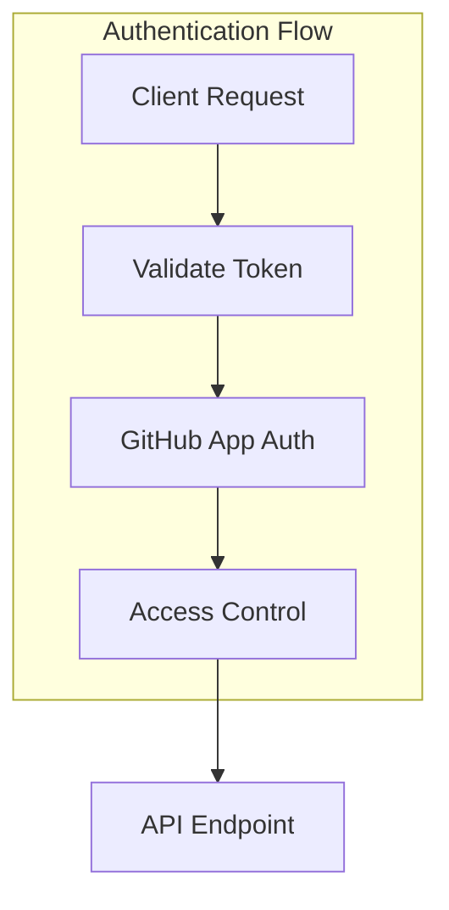
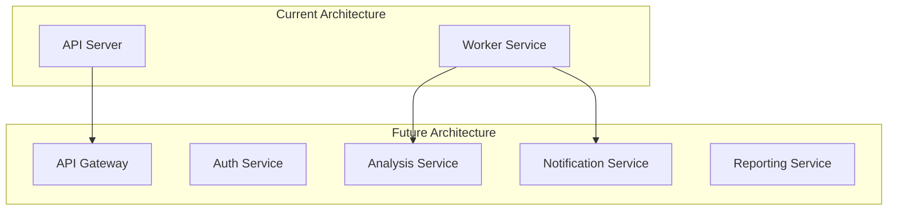

# FlakeGuard Architecture

This document describes the system architecture and design patterns used in FlakeGuard.

## System Overview

FlakeGuard is a distributed system designed to detect, monitor, and manage flaky tests in CI/CD pipelines. It follows a microservices architecture with clear separation of concerns.

## High-Level Architecture



## Core Components

### API Server (apps/api)

The API server is the central component that handles:

- **GitHub Webhook Processing**: Receives and processes GitHub events
- **REST API Endpoints**: Provides programmatic access to FlakeGuard features
- **Test Result Ingestion**: Parses and stores JUnit XML test results
- **Flake Analysis**: Runs flakiness scoring algorithms
- **Check Run Management**: Creates and updates GitHub check runs

**Technology Stack:**
- Fastify 4 (Web framework)
- Prisma 5 (Database ORM)
- Zod (Schema validation)
- Pino (Structured logging)
- TypeScript (Type safety)

**Key Features:**
- Webhook signature validation
- Rate limiting and security headers
- Automatic OpenAPI documentation
- Health checks and metrics
- Error handling and logging

### Worker Service (apps/worker)

The worker service processes background jobs asynchronously:

- **Test Analysis Jobs**: Analyzes test results for flakiness patterns
- **Report Generation**: Creates quarantine reports and recommendations
- **Notification Jobs**: Sends alerts and notifications
- **Cleanup Jobs**: Maintains data retention policies

**Technology Stack:**
- BullMQ (Job queue)
- Redis (Job storage)
- TypeScript (Type safety)

**Job Types:**
```typescript
enum JobType {
  ANALYZE_TEST_RESULTS = 'analyze-test-results',
  GENERATE_QUARANTINE_PLAN = 'generate-quarantine-plan',
  SEND_NOTIFICATION = 'send-notification',
  CLEANUP_OLD_DATA = 'cleanup-old-data'
}
```

### Database Layer

**PostgreSQL Database:**
- Primary data store for all persistent data
- Optimized indexes for query performance
- ACID compliance for data integrity

**Key Models:**
- `Installation`: GitHub App installations
- `Repository`: Repository metadata and settings
- `TestResult`: Individual test execution results
- `TestSuite`: Test suite metadata and statistics
- `FlakeDetection`: Flaky test analysis results
- `CheckRun`: GitHub check run tracking

**Redis Cache:**
- Job queue storage
- Session caching
- Rate limiting counters
- Temporary data storage

## Data Flow

### 1. GitHub Webhook Processing



### 2. Test Result Ingestion



### 3. Flake Detection Analysis



## Security Architecture

### Authentication & Authorization



**Security Layers:**
1. **GitHub App Authentication**: OAuth2 flow with private key signing
2. **Webhook Signature Validation**: HMAC-SHA256 verification
3. **Rate Limiting**: Per-IP and per-endpoint limits
4. **Input Validation**: Zod schema validation
5. **CORS Protection**: Configurable origin policies
6. **Security Headers**: Helmet.js security headers

### Data Protection

- **Encryption at Rest**: Database encryption for sensitive data
- **Encryption in Transit**: TLS 1.3 for all communications
- **Secret Management**: Environment variables with rotation
- **Access Logging**: Comprehensive audit trails

## Scalability Design

### Horizontal Scaling

**API Server Scaling:**
- Stateless design enables horizontal scaling
- Load balancer distributes requests
- Auto-scaling based on CPU/memory usage

**Worker Scaling:**
- Multiple worker processes
- Job distribution via Redis queue
- Dynamic scaling based on queue depth

### Performance Optimization

**Database Optimization:**
- Optimized indexes for common queries
- Connection pooling
- Query optimization and monitoring
- Read replicas for analytics queries

**Caching Strategy:**
```typescript
// Multi-layer caching
interface CacheStrategy {
  l1: 'memory',      // In-process cache
  l2: 'redis',       // Distributed cache
  l3: 'database'     // Persistent storage
}
```

**Query Patterns:**
```sql
-- Optimized for time-series analysis
CREATE INDEX CONCURRENTLY idx_test_results_time_series 
ON test_results (repository_id, created_at DESC, status);

-- Optimized for flake detection
CREATE INDEX CONCURRENTLY idx_test_results_flake_analysis 
ON test_results (repository_id, test_full_name, created_at DESC);
```

## Monitoring & Observability

### Metrics Collection

```typescript
// Prometheus metrics
interface Metrics {
  httpRequests: Counter;
  processingDuration: Histogram;
  activeJobs: Gauge;
  errorRate: Counter;
  flakeDetectionAccuracy: Histogram;
}
```

### Logging Strategy

```typescript
// Structured logging with correlation IDs
interface LogEntry {
  timestamp: string;
  level: 'info' | 'warn' | 'error';
  message: string;
  correlationId: string;
  context: Record<string, any>;
}
```

### Health Checks

**API Health Endpoints:**
- `/health`: Basic liveness check
- `/health/ready`: Readiness check (database connectivity)
- `/health/deep`: Deep health check (all dependencies)

**Worker Health Monitoring:**
- Job processing metrics
- Queue depth monitoring
- Error rate tracking

## Deployment Architecture

### Container Strategy

```dockerfile
# Multi-stage build for optimization
FROM node:20-alpine AS base
FROM base AS deps
FROM base AS builder
FROM base AS runner
```

### Infrastructure as Code

```yaml
# Docker Compose for development
version: '3.8'
services:
  api:
    build: ./apps/api
    environment:
      - DATABASE_URL
      - REDIS_URL
    depends_on:
      - postgres
      - redis
  
  worker:
    build: ./apps/worker
    environment:
      - DATABASE_URL
      - REDIS_URL
    depends_on:
      - postgres
      - redis
  
  postgres:
    image: postgres:16
    environment:
      POSTGRES_DB: flakeguard
    volumes:
      - postgres_data:/var/lib/postgresql/data
  
  redis:
    image: redis:7-alpine
    volumes:
      - redis_data:/data
```

## Error Handling & Resilience

### Error Categories

```typescript
enum ErrorType {
  VALIDATION_ERROR = 'validation_error',
  AUTHENTICATION_ERROR = 'authentication_error',
  RATE_LIMIT_ERROR = 'rate_limit_error',
  GITHUB_API_ERROR = 'github_api_error',
  DATABASE_ERROR = 'database_error',
  PROCESSING_ERROR = 'processing_error'
}
```

### Retry Patterns

```typescript
// Exponential backoff with jitter
class RetryStrategy {
  async execute<T>(
    operation: () => Promise<T>,
    maxRetries: number = 3,
    baseDelay: number = 1000
  ): Promise<T> {
    for (let attempt = 1; attempt <= maxRetries; attempt++) {
      try {
        return await operation();
      } catch (error) {
        if (attempt === maxRetries) throw error;
        
        const delay = baseDelay * Math.pow(2, attempt - 1);
        const jitter = Math.random() * 0.1 * delay;
        await this.sleep(delay + jitter);
      }
    }
    throw new Error('Max retries exceeded');
  }
}
```

### Circuit Breaker Pattern

```typescript
// Circuit breaker for external APIs
class CircuitBreaker {
  private failures = 0;
  private state: 'closed' | 'open' | 'half-open' = 'closed';
  private threshold = 5;
  private timeout = 60000;
}
```

## Configuration Management

### Environment-Based Configuration

```typescript
interface Config {
  // Server configuration
  server: {
    port: number;
    host: string;
    environment: 'development' | 'production' | 'test';
  };
  
  // Database configuration
  database: {
    url: string;
    poolSize: number;
    ssl: boolean;
  };
  
  // GitHub App configuration
  github: {
    appId: string;
    privateKey: string;
    webhookSecret: string;
  };
  
  // Feature flags
  features: {
    slackIntegration: boolean;
    advancedAnalytics: boolean;
    quarantineRecommendations: boolean;
  };
}
```

### Validation

```typescript
// Zod schema for configuration validation
const configSchema = z.object({
  server: z.object({
    port: z.number().min(1).max(65535),
    host: z.string().min(1),
    environment: z.enum(['development', 'production', 'test'])
  }),
  database: z.object({
    url: z.string().url(),
    poolSize: z.number().min(1).max(100),
    ssl: z.boolean()
  })
});
```

## Testing Strategy

### Test Pyramid

```
    E2E Tests (Few)
   ┌─────────────────┐
   │ Integration     │
   │ Tests (Some)    │
   └─────────────────┘
  ┌───────────────────┐
  │ Unit Tests (Many) │
  └───────────────────┘
```

**Unit Tests:**
- Business logic validation
- Algorithm correctness
- Utility function testing

**Integration Tests:**
- Database interactions
- API endpoint testing
- Service integration

**End-to-End Tests:**
- Complete workflow testing
- GitHub integration testing
- User journey validation

## Future Architecture Considerations

### Microservices Evolution



### Event-Driven Architecture

```typescript
// Event sourcing for audit trail
interface Event {
  id: string;
  type: string;
  aggregateId: string;
  payload: Record<string, any>;
  timestamp: Date;
  version: number;
}
```

### Machine Learning Integration

```typescript
// ML pipeline for flake prediction
interface MLPipeline {
  featureExtraction: (testData: TestResult[]) => Features;
  modelInference: (features: Features) => Prediction;
  modelRetraining: (feedback: Feedback[]) => Model;
}
```

This architecture provides a solid foundation for scalable, maintainable, and secure flaky test detection while allowing for future enhancements and optimizations.